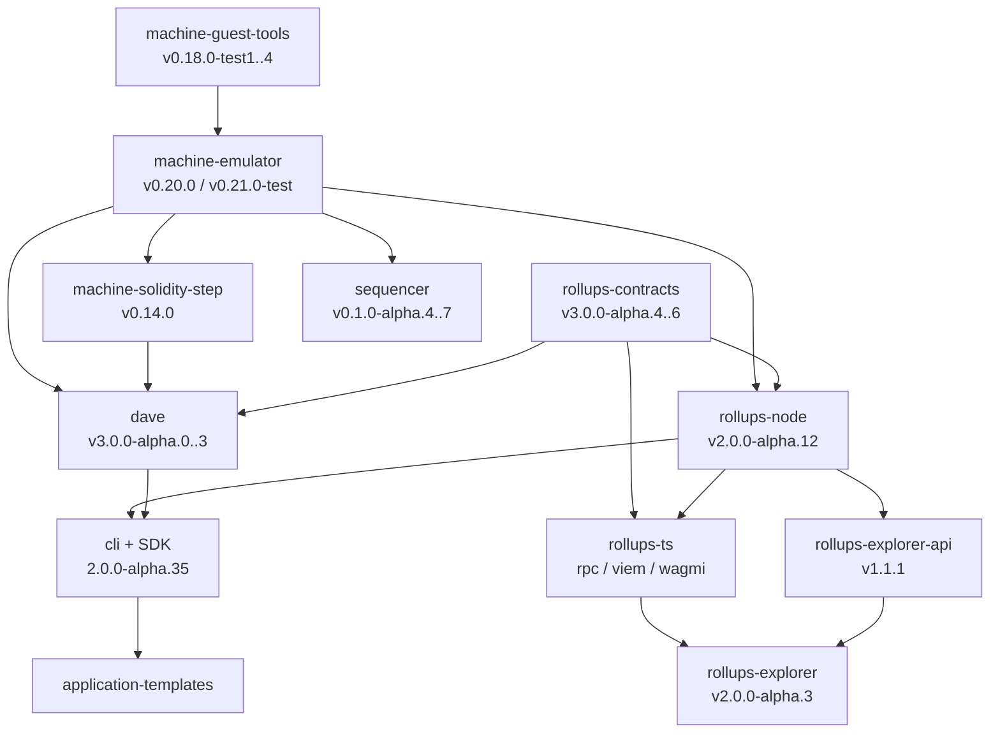
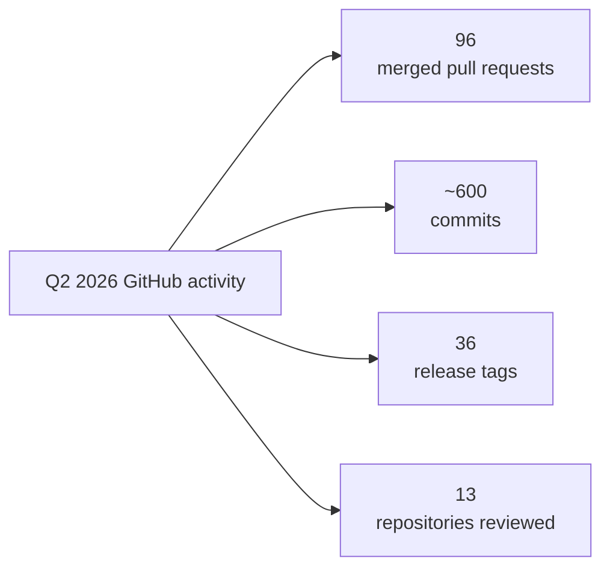

# Cartesi Technical Evolution Report - Q2 2026

**Window:** 1 April – 30 June 2026
**Scope:** Cartesi Rollups stack and related components

**In this report**

1. [Summary](#summary)
2. [Pillar 1 — Fast and reliable UX](#pillar-1--fast-and-reliable-ux)
3. [Pillar 2 — A stable and robust SDK for mainnet applications](#pillar-2--a-stable-and-robust-sdk-for-mainnet-applications)
4. [Pillar 3 — Recoverable application funds](#pillar-3--recoverable-application-funds)
5. [How the stack interlocks](#how-the-stack-interlocks)
6. [Infrastructure and release engineering](#infrastructure-and-release-engineering)
7. [External integrations and adoption](#external-integrations-and-adoption)
8. [Security posture and audits](#security-posture-and-audits)
9. [Demo DeFi implementations](#demo-defi-implementations)
10. [Line of sight into Q3](#line-of-sight-into-q3)
11. [Appendix A — GitHub activity](#appendix-a--github-activity)
12. [Appendix B — Delivery ledger](#appendix-b--q2-2026-delivery-ledger)
13. [Appendix C — Releases by product](#appendix-c--q2-2026-releases-by-product)

---

## Summary

Q2 2026 work was coordinated under three pillars: *fast and reliable UX*, *a stable and robust SDK for mainnet applications*, and *recoverable application funds*. Across them, previously independently versioned repositories moved onto a single integration sequence rather than shipping in isolation.

**Fast and reliable UX.** The sequencer entered the quarter as a prototype that could sequence transactions but could not survive its own failure modes. It left with automated recovery from stale batches, a catastrophic-loss rebuild path, an independent watchdog that detects divergence between the sequencer and the canonical machine, and a published operator runbook. A sequencer that cannot recover is not a latency improvement — it is a new single point of failure sitting in front of the rollup.

**A stable and robust SDK.** The hard problem is not stabilising any one component; it is getting the stack to agree on a version at once. Between 17 and 24 June, five releases came out of four components in dependency order — node, then SDK, then explorer, then CLI — each explicitly consuming the one before it. Alongside that convergence, the developer surface grew an agent-facing path: machine-readable documentation, reusable Cartesi skill packs, and an MCP knowledge server so coding agents follow curated procedures rather than scrape HTML. A completed set of DeFi demo implementations — Uniswap liquidity, Pandas on-chain data, lending risk, bonding curves, and combinatorial markets — showed what Linux-on-rollup is for in code developers can run.

**Recoverable application funds.** The contracts gained delayed claim acceptance, a substantially smaller account-validity proof, automatic revocation of owner privileges at foreclosure, and the groundwork for deposit refunds. For a 2^17-account application, the proof-size work reduced the user-supplied proof from 59 elements to 17, enabling a browser-based emergency withdrawal interface. User funds no longer depend on operator cooperation to be retrieved.

The same coordination clarified the remaining work for Q3. The last-week-of-June target was an official V2 with stable Authority and Emergency Withdrawal, plus PRT disputes in experimental mode. The releases in that window were coordinated **alpha** releases; stabilization remains the next milestone. Deposit refunds and live testnet deployment of the sequencer are among the open items carried into that outlook.

---

## Pillar 1 — Fast And Reliable UX

### Problem it addresses

Waiting for L1 finality on every user action takes minutes, which makes interactive applications impractical. The sequencer closes that gap by accepting signed user operations, confirming them immediately, and posting them to L1 in batches asynchronously. The guarantee that makes this safe is that the off-chain sequencer and the on-chain scheduler must produce an identical execution order.

That guarantee depends on the system's ability to detect and recover from failures. Entering the quarter, the sequencer could sequence transactions, but a stale batch, crash, or corrupted database required manual intervention without a defined procedure.

### Where it landed

**Target reached.** Q2 delivered recovery from stale batches, restart from snapshots, independent divergence detection, and recovery from local-state loss. Live testnet deployment continued into Q3.

### Deliveries

**Recovery from stale batches** landed in mid-May and addresses a specific failure cascade: when a batch reaches L1 too late, the scheduler skips it, which poisons the nonce counter and makes every subsequent batch unreachable regardless of its own freshness. The sequencer now detects the approach of that danger zone, preemptively goes offline, flushes the L1 mempool so delayed submissions cannot land later, and cascade-invalidates the doomed chain. Released as `v0.1.0-alpha.5` the same day.

The design was also formally verified. The repository includes TLA+ specifications for both the optimistic and preemptive recovery models, checked as part of the design process. These specifications complement testing of the ordering equivalence between the off-chain sequencer and on-chain scheduler.

**Snapshot capability** landed in early June. The inclusion lane now dumps application state at batch close, promotes it to finalised when L1 confirms, and garbage-collects superseded dumps. At startup the sequencer loads the latest snapshot and replays the persisted transaction stream from that offset. This is what makes restart cheap instead of catastrophic, and it is the precondition for everything that follows — both the watchdog and cockroach recovery consume snapshots.

**The watchdog** shipped in late June and was hardened for production the same day. It is an independent process that fetches the sequencer's finalised state and compares it against a view of the canonical Cartesi Machine at the same L1 inclusion block. On the reference template app, that comparison uses the machine's `inspect` output. A mismatch produces a structured event and a non-retryable exit — a deterministic mismatch is not a transient condition and must not be papered over by a retry loop.

The significance is architectural. The watchdog does not trust the sequencer's self-reporting; it recomputes the answer from the canonical machine and compares. That is the difference between monitoring and verification. Shortly after, the watchdog was published as a multi-arch container image to both GHCR and Docker Hub, versioned to match the sequencer release tag, so operators deploy a matched bundle rather than assembling one.

**Cockroach recovery** landed on the final day of the quarter. This is the catastrophe path: when the local database is lost or has diverged irrecoverably, there is no batch tree left to cascade. The operator wipes the data directory and rebuilds canonical state from a trusted checkpoint by folding L1 forward.

The fold engine uses the same scheduler source compiled into the on-chain canonical machine. This design aligns reconstruction with L1 and avoids introducing a parallel implementation that could drift.

Supporting work early in the quarter implemented log-space fees and reworked the end-to-end test and benchmark harnesses; late in the quarter the sequencer's environment variable names were aligned with `rollups-node` conventions so operators can run both without maintaining two mental models.

### Why it matters

The delivered capabilities address distinct operational failure modes: recovery from L1 congestion, automatic detection of divergence, and a defined, tested procedure for total local state loss. The operator playbook documents deployment runbooks, staging drills, recovery design, the threat model, and invariants for operators.

The repository documents an important limitation: soft confirmations remain an optimistic prediction. Divergence is detected when the offending batch reaches L1 safe finality, so confirmations issued within that roughly two-epoch window can be built on already-diverged state. This bounded window is inherent to the optimistic model and should be understood by users of the confirmation guarantee.

### Sequencer and application integration

Running the sequencer against a reference wallet application was both the target and the achievement. The wallet prototype implements the `Application` trait and was substantially extended during the quarter, with the canonical app gaining a dedicated Sepolia binary alongside the devnet one as part of the setup/run command split at the end of June.

The interface for downstream consumers was made ready: the internal snapshot endpoints that indexers and the watchdog consume, the deterministic WebSocket replay feed, and the operator deployment model are all in place.

The watchdog's use of `inspect` for comparison and verification is an example on that template app, not a prescribed integration pattern. How the application exposes a comparable state for the watchdog — and how robust that check needs to be — is something the developer must specify when wiring the functionality in.

### Carrying into Q3

Live testnet deployment is the outstanding item. The infrastructure exists — a Sepolia binary, a Sepolia-and-mainnet operator runbook, published container images — with follow-on work on plaintext RPC to trusted private hosts, watchdog tick metrics, and operator-reported deployment issues still in progress.

---

## Pillar 2 — A Stable And Robust SDK For Mainnet Applications

### Problem it addresses

The goal was an official V2 of the SDK carrying Authority consensus and Emergency Withdrawal as stable, robust features, with the PRT dispute algorithm available experimentally alongside them.

The V2 line is currently published as alphas, which is what gives this pillar its weight. A team choosing where to run a mainnet application wants to know the interfaces will hold and what support sits behind them — a question answered by accumulated evidence: coverage, integration testing under failure, soak time, and a settled API surface. Mainnet asks for more of it, since contracts custodying user funds are difficult to amend once deployed. Readiness for LLM-based coding belongs on that list too: developers increasingly reach the stack through a coding agent first, so documentation and guidance an agent can consume accurately is now part of what makes the SDK usable.

Alongside that sits a coordination question. "The SDK" is not one artifact — it is an emulator, an on-chain step verifier, guest tools, contracts, a node, a CLI, TypeScript libraries, templates, and an explorer, each with its own release cadence and each depending on several others. A stable designation carries most meaning when all of them reach it together, which is why the version alignment achieved this quarter is the groundwork the designation rests on.

### Where it landed

The coordinated integration sequence was delivered on schedule, while the stability designation remains a work in progress. Five releases across four components landed between 17 and 24 June, meeting the last-week-of-June target. Every release was an alpha; the remaining work includes test coverage, documentation, and soak time for stable releases.

### Convergence

The sequence is worth reading in order, because each release explicitly consumed the previous one:

- 17 June — `rollups-node` `v2.0.0-alpha.12`, absorbing the contracts 3.0.0 alpha line on top of `machine-emulator` `v0.20.0`
- 18 June — `@cartesi/sdk` `0.12.0-alpha.40` and `alpha.41`, bumping `rollups-node` to `alpha.12`
- 22 June — `rollups-explorer` `v2.0.0-alpha.3`, raising its supported node version to `alpha.12` to absorb the API breaking changes
- 24 June — `@cartesi/cli` `2.0.0-alpha.35`, bumping both the default SDK to `alpha.41` and `rollups-explorer` to `alpha.3`

### Foundation layer

`machine-emulator` shipped **v0.20.0** on 9 April and ran the entire `v0.21.0` test line through June. It was the busiest component in this quarter, with documentation commits substantially outnumbering feature commits, alongside feature and reliability work.

Two changes stand out. A fuzzer harness was added and the bugs it found were fixed — a direct investment in the core guarantee that two independent implementations reach bit-identical states. NVRAM was implemented, adding guest-visible UIO memory ranges with automatic address assignment from the shared drive pool.

The June feature line is thematically tight and points directly at the funds-recovery pillar: revert root hash accessors across all API layers, recording the revert root hash in `send_cmio_response`, substituting it when collecting hashes over rejected inputs, per-output proof emission from `--cmio-advance-state`, and proving the output-hashes root sits in the accepting state. Emergency withdrawal needs proofs that remain valid when some inputs were rejected. This is the emulator being taught to produce them.

`machine-solidity-step` released **v0.14.0** on 13 April, combining the interpreter checkpoint, adding coverage, and bumping Solidity, forge-std and Foundry. The rename of `checkpoint-hash` to `revert-root-hash` is the on-chain half of the emulator's revert-hash work. `machine-guest-tools` moved through four `v0.18.0` test releases between April and May.

### Node layer

`rollups-node` did the heaviest integration work of the quarter. Absorbing the contracts 3.0.0 alpha line in mid-June is what made the convergence cluster possible.

Three changes deserve attention on their own merits.

HTTP hardening landed in April across all three surfaces, with a standard middleware chain: panic recovery that ensures error values never reach a response body, request ID validation against a safe charset, CORS disabled by default with exact-match origins only when configured, and admission control capping concurrent in-flight requests with a jittered `Retry-After` to prevent thundering herds. These controls support deployments that must handle untrusted traffic.

The EVM reader moved from WebSocket notifications to polling in mid-June. When per-block processing exceeded the block time, notifications accumulated and the reader fell behind, processing one stale block at a time. Polling lets it skip to the most recent block and recover from this backlog.

Validator hardening and integration test sharding followed — a direct investment in the cycle time of exactly this kind of coordinated release.

### Fraud-Proofs (PRT) in experimental mode

Official repository of Cartesi's fraud-proof system - `dave` released four `v3.0.0-alpha` versions across the quarter, tracking `rollups-contracts` closely enough that the 19–21 May releases are effectively simultaneous. The settlement and fraud-proof layers are versioned together to maintain compatibility between the dispute game and the contracts it settles against.

A reentrancy vector in PRT was closed in early April. The emulator was bumped to 0.20 at the end of April, and an unused Cannon and pnpm dependency was removed in late June, deleting thousands of lines of dependency surface.

The experimental availability target was met on the distribution side when the `cartesi-rollups-prt` binary was added to the SDK's Nitro init scripts in mid-June. PRT stopped being something you build from source and became something the SDK ships.

### Developer surface

Late June is where the quarter's contract work becomes something a developer can use: support for a claim staging period in the run and deploy flow, withdrawal configurations loadable from TOML files, per-service environment variable listing in JSON, and fork mode validation. The withdrawal output builder was deployed to the devnet earlier in the month, and `address-book` gained the ability to print a single contract's address.

`rollups-ts` tracked the node's evolving API through the quarter, shipping six alpha releases of `@cartesi/rpc`, `@cartesi/viem`, and `@cartesi/wagmi`. Critically, RPC types were updated against *upcoming* node API changes rather than shipped ones — the TypeScript layer was being developed ahead of the node rather than lagging it, which is why the June convergence was possible at all.

`application-templates` stayed current with base image and CLI bumps, keeping the first-run experience aligned with the SDK.

### Agent-facing surface

An SDK is only as robust as the instructions developers build against, and in Q2 that surface was rebuilt around a second audience: AI agents.

`docs` **became machine-readable.** An LLM-readability layer now ships `llms.txt` and `llms-full.txt` sitemaps, a `.md` URL for every page, and content negotiation so a request carrying `Accept: text/markdown` returns source markdown instead of rendered HTML — served by an Amplify Gen 2 CDK backend with CloudFront and Lambda, with per-file-type CDN cache headers. The mechanism matters more than the artifact. An agent reading documentation as HTML gets navigation chrome, rendered components and copy buttons mixed into the prose; one reading `.md` gets the text. Negotiating by header keeps a single canonical source rather than a parallel agent corpus that silently drifts from the human one. A "Build with AI" section sits alongside it: a copy-page plugin, a spec-driven development prompt pattern, and setup tabs for Codex, Claude Desktop and VS Code.

Delivery infrastructure moved in parallel — per-PR preview deployments and a production deploy path — making the documentation site a reviewable artifact per change rather than something inspected after merge. On content, the quarter added a `cartesi.toml` configuration guide, a guide to forking existing chains, realignment of the v2 asset wallet tutorials to Rollups v2 with an ERC-1155 wallet tutorial, and an assets management refresh.

`cartesi-skills` **released** `v0.1.0` — eleven skill packs covering scaffolding, backend core with separate Python and JS/TS variants, contracts, frontend, local development, deployment, JSON-RPC and debugging, plus a workflow pack that routes an agent to the right one. Each is pinned to explicit versions: CLI `2.0.0-alpha.34`, node `2.0.0-alpha.11`, contracts `v2.2.0`. The packs were later updated for the contracts v3 lifecycle and node `alpha.12` deployment guidance, tracking the June convergence.

`MCP-Server` **exposes that material over Model Context Protocol** — FastMCP over streamable HTTP, 29 tools, backed by PostgreSQL, with skills and article bodies stored inline for direct agent access. The quarter added ERC-721 and ERC-1155 deposit instruction tools alongside the existing ERC-20 and ETH ones, a configurable depositor wallet, and a search rewrite replacing full-text search that returned empty results for natural-language queries. A container image release pipeline accompanied the tool surface. The admin pair provides the curation layer: full CRUD for articles and skills, paginated lists, tag search, admin presence tracking, hardened multi-stage production images, and a fly.io deployment flow. Together, these systems support ongoing editorial maintenance as the SDK evolves.

NOTE: Apart from official `docs`, this surface is built by Mugen-Builders outside the core release train, and its activity is not counted in Appendix A. It belongs in this pillar regardless, because the stability a developer actually experiences is now partly a function of whether their agent has current instructions.  

### Why it matters

The gap between alpha and stable releases remains. June demonstrated coordinated compatibility across the stack. The remaining work includes the test coverage, documentation, and soak time required to convert that integration into supported stable releases. Q3 is focused on these activities.

### Carrying into Q3

The emulator `v0.21.0` line continues with breaking changes: modelling cycle overflows as persistent fixed points and streamlining the CMIO response and verification APIs. `machine-solidity-step` is tracking that line. A node bump to emulator v0.21.0 and rootfs v0.18.0 remains open and is expected to trigger the next convergence cycle — worth watching whether it runs faster than June's now that the pattern is established. `rollups-ts` has begun renaming its public packages — `@cartesi/wagmi` to `@cartesi/react` and `@cartesi/viem` to `@cartesi/client` — plus a new `@cartesi/codec` package, the kind of API-surface decision made shortly before committing to stability.

---

## Pillar 3 — Recoverable Application Funds

### Problem it addresses

An application that holds user assets creates an obligation that outlives the application. If the operator disappears, misbehaves, or the application is foreclosed, users must still be able to retrieve their funds — without needing the operator's cooperation, and without needing to run infrastructure themselves.

Emergency Withdrawal is the mechanism. Getting it right is delicate: it must be impossible to trigger fraudulently, cheap enough that users will actually use it, and usable from a browser rather than requiring a full node.

### Where it landed

Delayed claim acceptance, account proof size reduction, and foreclosure hardening all completed within the quarter. Deposit refunds, the remaining piece, was prepared in June and remains in progress.

### Deliveries

**Claim staging** changed when a claim takes effect. Previously a claim submitted by an Authority owner or a Quorum majority took effect immediately. Now it is marked staged and can only be accepted after a staging period elapses.

The staging period gives observers time to detect and respond to a fraudulent or mistaken claim before it becomes final. The implementation minimised changes to core contracts to reduce defect risk. A related correctness bug where Quorum failed to revert on claim resubmission was fixed shortly after.

**Smaller account validity proofs** split account validation into two steps. Previously each user proved their account with a full account-root-to-machine-root proof. Now, once the application is foreclosed, the accounts-drive Merkle root is proved against the last-finalised machine root, and individual accounts are validated against that already-proved root.

For an application supporting 2^17 accounts, the user-supplied proof drops from 59 elements to 17 — a 3.5x reduction. Because users need the account recovery state file rather than the whole machine, a withdrawal interface can run in a browser. The first, more expensive proof only needs to be provided once, reducing recovery costs for every user of that application.

An event for the accounts-drive root being proved was added so interfaces can detect that the first step is done rather than probing for it.

**Foreclosure hardening.** Application owner privileges are now disabled upon foreclosure, preventing an owner from retaining those privileges after the application has failed. A withdrawal-config getter was added and the application address is now passed through to `buildWithdrawalOutput`.

**Deposit refunds groundwork.** Mid-June saw a large preparatory change: removing the pnpm, Cannon and Changesets dependency chain, stopping publication of the `@cartesi/rollups` npm package in favour of Solidity artifacts distributed through GitHub releases, and making contract deployments type-safe through code generation rather than raw encoded bytecode.

Removing publishing dependencies reduces the attack surface, with immutable releases planned as a further layer. For contracts that will custody mainnet funds, removing the package-publishing pipeline from the trusted path is part of the security posture. The deposit-refunds feature itself carried into Q3 as work in progress.

### How it reaches users

The chain from contract primitive to user interface completed within the quarter, and it is the clearest illustration of the stack operating as one system:

Claim staging landed in the contracts at the end of April. The node adopted the contract version in mid-June. The CLI exposed a claim staging period in its run and deploy flow in late June. Separately, foreclosure privilege revocation landed in mid-May, and in late June the explorer disabled the Send button for foreclosed applications with an explanatory tooltip and correct ARIA state — replacing an unexplained transaction revert with a clear reason. Foreclosure indicators and diagnostic reasons were added to the application and epoch status UI, and connections to unsupported node versions were blocked.

This path moved from contract primitive to a user-visible affordance across four components in eight weeks, following the relevant release dependencies.

### Why it matters

Each delivery narrows the gap between "funds are recoverable in principle" and "a user can actually recover them." Claim staging makes fraudulent finalisation detectable. Proof size reduction makes recovery affordable and browser-viable. Foreclosure hardening removes the failed operator from the picture. Deposit refunds close the last case — funds in flight when the application failed.

### Carrying into Q3

Deposit refunds remain open as work in progress. Claim staging into the PRT contracts — the settlement primitive moving into the fraud-proof layer — and a machine yield check on the contracts side are likewise carried forward.

---

## How the stack interlocks

The single most important structural fact about Q2 is that changes propagated along a consistent path, in a consistent order.

Four concrete couplings:

**Contracts and fraud proofs move as one unit.** `rollups-contracts` `v3.0.0-alpha.5` and `dave` `v3.0.0-alpha.2` both released 19 May; `alpha.6` and `alpha.3` both on 21 May. A dispute game that disagrees with the contracts it settles against is not a dispute game.

**The node is the integration pivot.** Absorbing the contracts 3.0.0 alpha line is what made the June convergence possible, and the node's `alpha.12` release on 17 June is what the SDK, explorer and CLI then targeted within a week.

**The emulator's revert-hash work spans three layers.** Accessors were added to the emulator's C, Lua and JSON-RPC APIs in May; `machine-solidity-step` renamed `checkpoint-hash` to `revert-root-hash` in April to match; the emulator recorded it in `send_cmio_response` in June. Off-chain and on-chain implementations must agree bit for bit, so this vocabulary alignment is a correctness requirement, not tidiness.

**The sequencer runs on its own track for now.** It pins the machine emulator and shares deployment conventions, but nothing downstream consumed it this quarter. Aligning its environment variable names with `rollups-node` late in June is the first step toward that changing — integration at the deployment layer, and the precondition for operators running both without maintaining two mental models.

---

## Infrastructure and release engineering

**Supply-chain hardening was a cross-component theme.** CI actions were pinned by digest across the emulator, solidity step, and dave. Digest pinning means a compromised action tag cannot silently alter a build. Alongside it, `rollups-contracts` removed its npm publishing pipeline entirely.

**Deployment became deterministic.** Deployment addresses are now chain-independent and distributed as artifacts. The same contract now lives at the same address on every chain, which removes a category of configuration error from every downstream tool — and is what lets the CLI's `address-book` be useful rather than per-network bookkeeping.

**Test infrastructure kept pace.** The explorer gained a test framework where it previously had none. The node introduced integration test sharding. The emulator added early CI rejection of bad commits and Lua coverage tracking. The solidity step added coverage for the step itself.

**Container distribution matured.** Multi-arch watchdog images are published to GHCR with a Docker Hub mirror, versioned to match the release tag so binaries, machine images, and the watchdog ship as one bundle.

---

## External Integrations and Adoption

**RISC Zero zkVM — proving Cartesi Machine steps.** The emulator now carries an in-tree RISC Zero integration that proves Cartesi Machine state transitions as zero-knowledge proofs. Given a step log (the same access log used by fraud-proof bisection), the pipeline generates a proof that the transition from `root_hash_before` over `mcycle_count` cycles to `root_hash_after` is valid.

The stack has three layers:

- **Guest (RISC-V inside RISC Zero).** A freestanding guest binary replays the logged step via C++ (`risc0_replay_steps`), recomputes Merkle hashes inside the zkVM, and emits an ABI-encoded journal matching Solidity's `abi.encode(bytes32, uint64, bytes32)`.
- **Host prover (Rust).** `cartesi-risc0-cli` drives prove → verify → compress (STARK receipt to Groth16 seal) → verify-seal. Guest binaries are built in Docker so every machine produces the same Image ID — a prerequisite for on-chain verification. CUDA-backed in-process proving is available as an alternative to the external `r0vm`.
- **On-chain verifier (Solidity).** `CartesiStepVerifier` submits the 260-byte Groth16 seal to the RISC Zero Verifier Router (Sepolia today), which runs an `ecPairing` precompile at roughly 300k gas, then checks the journal against the expected before/after hashes and cycle count.

The integration test suite covers the full path: dev-mode interpreter tests, real proving (~3 minutes on an M4 Pro), and Foundry tests against a Sepolia fork. This sits alongside the existing interactive fraud-proof path (Dave / PRT + `machine-solidity-step`). Where fraud proofs use bisection, RISC Zero provides a path to succinct, non-interactive verification of the same state transition.

Q2 activity on this surface was largely maintenance and API alignment (dependency bumps in the Rust guest/host crates, CI lock of the rzup install, and verify-API refactors shared with the broader emulator), on top of the prover that landed earlier in the year. The distribution story also matured: official packages for the emulator now span APT, APK, AUR, and Homebrew, with the RISC Zero toolchain documented as an optional build dependency.

**Uniswap TWAP price oracle.** Early Q3 work adds a Uniswap V3 TWAP fee oracle to the sequencer — the first external protocol dependency in its fee model. The sequencer charges in an application-defined fee token, but its costs are denominated in L1 gas, so something has to bridge the two. The oracle runs as a supervised background worker that converts base plus priority gas into fee-token smallest units through a pinned WETH/fee-token pool, applies a fixed ten-times slack, and writes the result into the batch policy in log space. Local Anvil uses an explicit fixed exponent instead, so development does not require a live pool.

The design choices around it are conservative in a way worth noting. The pool is pinned by operator configuration and reviewed ahead of time rather than discovered dynamically. A successful refresh is mandatory before the inclusion lane will start, so the sequencer fails closed rather than opening with a stale or absent price. Frame fees are sampled once at frame open and stay immutable for that frame's lifetime, which keeps pricing predictable for users mid-frame. Transient quote failures retain the last known price, and a provider outage is left to the existing L1 stale-view danger detector rather than introducing a second, competing oracle timer.

The threat model classifies the pool as semi-trusted L1 state and documents what that buys and what it does not. Spot manipulation of a deep pool is mitigated by a thirty-minute TWAP window plus the slack multiplier. The residual risks are recorded plainly: TWAP lag during genuine price moves, misconfiguration onto a thin or wrong pool, and observation-cardinality gaps, which are refused at startup. Multi-hop pricing is explicitly out of scope. Taking an external protocol dependency into a component that prices user transactions is the kind of change that deserves this treatment, and it received it.

**Account abstraction and paymaster tooling** continued in the CLI, including work to replace Alto with Rundler and Foundry bumps for paymaster general availability.

**SQD archive gateways.** The explorer API added authentication for SubSquid archive nodes. On restart, the API checked archive nodes first, received a `403`, and the processor stopped while the GraphQL API continued serving stale data without an error. Authentication prevents this failure mode.

---

## Security Posture and Audits

Security work within this quarter took these forms:

- **Formal verification.** TLA+ specifications for the sequencer's optimistic and preemptive recovery models, with a documented threat model and explicit invariants.
- **Fuzzing.** A fuzzer harness was added to the emulator and the defects it surfaced were fixed.
- **Attack-surface reduction.** Reentrancy protection in PRT, HTTP hardening in the node, CI digest pinning, and removal of the contracts npm publishing pipeline.
- **Correctness fixes in fund-handling paths.** Quorum claim-resubmission behaviour and owner-privilege revocation at foreclosure.
- **Trust-model documentation.** The sequencer documents its own limitations — censorship capability, the bounded window in which soft confirmations can be built on diverged state, and the operator-trusted inputs to cockroach recovery — rather than only its guarantees.

An external audit of the contracts and sequencer remains an open prerequisite for a stable mainnet designation.

### Internal testing rounds

Internal testing rounds were conducted across the stack during the quarter. [#todo - add testing with AI agents devad contribution]

---

## Demo DeFi implementations

The stack work above is infrastructure. Q2 also completed a set of DeFi demo implementations and tutorials, posted through X handle `@cartesiproject` and amplified in the Weeklies. These examples let developers open a repository, follow a walkthrough, and see familiar DeFi problems implemented with a full Linux stack inside the Cartesi Machine.

**Uniswap liquidity vault.** DeFi runs on liquidity, and the architectural move for integrating Uniswap into a Cartesi app is a vault contract that turns idle deposits into active liquidity. The demo shows that pattern end-to-end on Base Sepolia rather than stopping at a diagram. Repo: [Mugen-Builders/cartesi-uniswap-integration](https://github.com/Mugen-Builders/cartesi-uniswap-integration).

**On-chain data with Pandas.** Managing real DeFi datasets on the EVM is awkward; libraries developers already know are not available there. The Pandas tutorial walks through bringing Python data manipulation into a Cartesi app, treating on-chain state as something a data scientist can query rather than something a Solidity loop must reimplement. Repo: [Mugen-Builders/pandas-example](https://github.com/Mugen-Builders/pandas-example).

**Lending risk and token mechanics.** Two companion demos, both built with Python inside the machine and carried by the Weeklies, fill out the lending and issuance sides: a [risk prediction model](https://x.com/cartesiproject/status/2055273057129058719) for lending and borrowing positions on Aave-like protocols using NumPy, and a [bonding-curve build](https://x.com/cartesiproject/status/2060346474551185423) that puts token price mechanics onchain. Adjacent work [wired a Chainlink price feed](https://x.com/riseandshaheen/status/2047247344828395616) into a Cartesi app and, later in the quarter, a [financial-modeling walkthrough](https://x.com/joaopdgarcia/status/2067601502110179709) covering Black-Scholes and Monte Carlo-style simulation — the class of computation that does not belong in Solidity and is exactly what Linux-on-rollup is for.

**Combinatorial information markets.** Real-world forecasts are not independent events. Inflation moves rates; elections move policy; a team winning its group reshapes a bracket. The [combinatorial information market demo](https://x.com/cartesiproject/status/2069410399909564883) runs deterministic, reproducible probabilistic inference on Cartesi so correlated outcomes can be priced as one market rather than as a bag of isolated bets. A [walkthrough video](https://www.youtube.com/watch?v=TJs2qlmN2ng) accompanies the post.

Together, these examples cover data tooling, liquidity integration, risk, issuance, oracles, quantitative modeling, and prediction markets. They demonstrate Cartesi as an execution layer for workloads that are impractical to host on the EVM, through code developers can run.

---

## Line of sight into Q3

**Closing out Q2 commitments.** Deposit refunds and claim-staging propagation into dave remain open from the funds-recovery track. Live testnet deployment of the sequencer is the highest-visibility carry-over on the UX side.

**The next emulator convergence.** Emulator `v0.21.0` carries breaking changes — persistent cycle-overflow fixed points and streamlined CMIO APIs. `machine-solidity-step` is tracking that line, and a node bump of the emulator and rootfs together is expected to trigger a second stack-wide convergence. Worth watching whether it runs faster than June's now that the pattern is established.

**PRT audit and hardening.** A PRT contracts audit campaign in `dave` is underway or queued for early Q3, covering design outcomes, findings, test assessment, compatibility witnesses, and refund calibration. Follow-on hardening of the dispute-game contracts, a safety gate, and a Proto Sling node sit on the same track.

**SDK API stabilisation.** Public package renames and a new codec package point toward freezing the surface, including sequencer wallet extensions on the TypeScript side. Stabilising the alpha line remains the next milestone after the June convergence.

**Node operability.** Open work covers single-process multi-service refactoring, AWS KMS dynamic-fee signing, secret file permissions, and JSON-RPC API improvements for production operation.

---

## Appendix A — GitHub activity

Q2 activity across the repositories reviewed:

| Repository              | Merged PRs | Primary branch used   | Q2 releases |
| ----------------------- | ---------- | --------------------- | ----------- |
| `rollups-contracts`     | 16         | `next/3.0`            | 3           |
| `cli`                   | 15         | `prerelease/v2-alpha` | 6           |
| `rollups-explorer`      | 11         | `main`                | 1           |
| `rollups-node`          | 10         | `next/2.0`            | 1           |
| `dave`                  | 10         | `next/3.0`            | 4           |
| `sequencer`             | 9          | `main`                | 4           |
| `machine-solidity-step` | 8          | `main`                | 1           |
| `machine-emulator`      | 7          | `main`                | 5           |
| `rollups-ts`            | 5          | `prerelease/v2-alpha` | 6           |
| `application-templates` | 3          | `prerelease/sdk-12`   | 0           |
| `machine-guest-tools`   | 1          | `main`                | 4           |
| `rollups-explorer-api`  | 1          | `main`                | 1           |
| `honeypot`              | 0          | —                     | 0           |

---

## Appendix B — Q2 2026 delivery ledger

Complete list of pull requests merged between 1 April and 30 June 2026. This is the evidence backing the report above; pull-request references are concentrated here rather than inlined throughout the body.

| Date   | Repository            | PR                                                                                                                                                                                       | Title                                              | Pillar |
| ------ | --------------------- | ---------------------------------------------------------------------------------------------------------------------------------------------------------------------------------------- | -------------------------------------------------- | ------ |
| 01 Apr | sequencer             | [#11](https://github.com/cartesi/sequencer/pull/11)                                                                                                                                      | Log space fees, e2e tests and benchmarks           | UX     |
| 07 Apr | dave                  | [#259](https://github.com/cartesi/dave/pull/259)                                                                                                                                         | Avoid reentrancy attacks on PRT                    | SDK    |
| 07 Apr | rollups-explorer      | [#449](https://github.com/cartesi/rollups-explorer/pull/449)                                                                                                                             | Add outputs list page                              | SDK    |
| 08 Apr | dave                  | [#260](https://github.com/cartesi/dave/pull/260)                                                                                                                                         | Custom errors and Rollups contracts bump           | SDK    |
| 08 Apr | application-templates | [#81](https://github.com/cartesi/application-templates/pull/81)                                                                                                                          | Bump ubuntu baseimage to noble-20260324            | SDK    |
| 08 Apr | application-templates | [#82](https://github.com/cartesi/application-templates/pull/82)                                                                                                                          | Bump @cartesi/cli to v2.0.0-alpha.34               | SDK    |
| 09 Apr | machine-guest-tools   | [#103](https://github.com/cartesi/machine-guest-tools/pull/103)                                                                                                                          | Fix generated libcmt ffi.h                         | SDK    |
| 09 Apr | machine-emulator      | [#355](https://github.com/cartesi/machine-emulator/pull/355)                                                                                                                             | Release v0.20.0                                    | SDK    |
| 09 Apr | machine-emulator      | [#363](https://github.com/cartesi/machine-emulator/pull/363)                                                                                                                             | Add fuzzer harness and fix bugs it found           | SDK    |
| 09 Apr | machine-emulator      | [#365](https://github.com/cartesi/machine-emulator/pull/365)                                                                                                                             | Cache shadow register page in replay               | SDK    |
| 10 Apr | machine-solidity-step | [#85](https://github.com/cartesi/machine-solidity-step/pull/85)                                                                                                                          | Combine interpreter checkpoint                     | SDK    |
| 10 Apr | machine-solidity-step | [#89](https://github.com/cartesi/machine-solidity-step/pull/89)                                                                                                                          | Coverage for solidity step                         | Infra  |
| 10 Apr | machine-solidity-step | [#91](https://github.com/cartesi/machine-solidity-step/pull/91)                                                                                                                          | Bump Ubuntu to 24.04                               | Infra  |
| 10 Apr | machine-solidity-step | [#92](https://github.com/cartesi/machine-solidity-step/pull/92)                                                                                                                          | CI bump and lock actions digest                    | Infra  |
| 11 Apr | machine-solidity-step | [#88](https://github.com/cartesi/machine-solidity-step/pull/88)                                                                                                                          | Rename checkpoint-hash to revert-root-hash         | Funds  |
| 13 Apr | machine-emulator      | [#373](https://github.com/cartesi/machine-emulator/pull/373)                                                                                                                             | Rename many files                                  | SDK    |
| 13 Apr | rollups-explorer      | [#452](https://github.com/cartesi/rollups-explorer/pull/452)                                                                                                                             | Improve data fetch error and connectivity          | SDK    |
| 13 Apr | machine-solidity-step | [#90](https://github.com/cartesi/machine-solidity-step/pull/90)                                                                                                                          | Release v0.14.0                                    | SDK    |
| 13 Apr | machine-solidity-step | [#94](https://github.com/cartesi/machine-solidity-step/pull/94)                                                                                                                          | Bump Solidity, forge-std and Foundry               | Infra  |
| 14 Apr | machine-emulator      | [#375](https://github.com/cartesi/machine-emulator/pull/375)                                                                                                                             | Early rejection of commits by CI                   | Infra  |
| 14 Apr | machine-solidity-step | [#97](https://github.com/cartesi/machine-solidity-step/pull/97)                                                                                                                          | CI lock missing upload artifact action             | Infra  |
| 15 Apr | machine-emulator      | [#378](https://github.com/cartesi/machine-emulator/pull/378)                                                                                                                             | CI lock actions digests                            | Infra  |
| 16 Apr | rollups-contracts     | [#496](https://github.com/cartesi/rollups-contracts/pull/496)                                                                                                                            | Add version getter                                 | Funds  |
| 16 Apr | rollups-node          | [#773](https://github.com/cartesi/rollups-node/pull/773)                                                                                                                                 | Fixes on service logs and help output              | SDK    |
| 22 Apr | rollups-contracts     | [#506](https://github.com/cartesi/rollups-contracts/pull/506)                                                                                                                            | Convert error strings into custom errors           | Funds  |
| 22 Apr | rollups-node          | [#774](https://github.com/cartesi/rollups-node/pull/774)                                                                                                                                 | HTTP hardening                                     | SDK    |
| 27 Apr | dave                  | [#263](https://github.com/cartesi/dave/pull/263)                                                                                                                                         | Fix emulator binding json schema                   | SDK    |
| 27 Apr | rollups-contracts     | [#514](https://github.com/cartesi/rollups-contracts/pull/514)                                                                                                                            | **Claim staging**                                  | Funds  |
| 28 Apr | dave                  | [#241](https://github.com/cartesi/dave/pull/241)                                                                                                                                         | Bump emulator to 0.20                              | SDK    |
| 28 Apr | machine-emulator      | [#380](https://github.com/cartesi/machine-emulator/pull/380)                                                                                                                             | Implement the new NVRAM option                     | SDK    |
| 29 Apr | cli                   | [#464](https://github.com/cartesi/cli/pull/464)                                                                                                                                          | Bump docker actions                                | Infra  |
| 29 Apr | rollups-contracts     | [#515](https://github.com/cartesi/rollups-contracts/pull/515)                                                                                                                            | **Smaller account validity proof**                 | Funds  |
| 05 May | rollups-contracts     | [#500](https://github.com/cartesi/rollups-contracts/pull/500)                                                                                                                            | Version Packages (alpha)                           | Funds  |
| 05 May | rollups-contracts     | [#516](https://github.com/cartesi/rollups-contracts/pull/516)                                                                                                                            | Fix Quorum NotFirstClaim on resubmission           | Funds  |
| 06 May | dave                  | [#264](https://github.com/cartesi/dave/pull/264)                                                                                                                                         | Bump rollups-contracts to 3.0.0-alpha.4            | SDK    |
| 06 May | dave                  | [#265](https://github.com/cartesi/dave/pull/265)                                                                                                                                         | Bump Debian and Boost on CI and Dockerfile         | Infra  |
| 06 May | rollups-explorer      | [#450](https://github.com/cartesi/rollups-explorer/pull/450), [#453](https://github.com/cartesi/rollups-explorer/pull/453), [#456](https://github.com/cartesi/rollups-explorer/pull/456) | Dependency bumps (vite, next, postcss)             | Infra  |
| 07 May | rollups-node          | [#720](https://github.com/cartesi/rollups-node/pull/720)                                                                                                                                 | Bump emulator to v0.20.0                           | SDK    |
| 14 May | rollups-explorer      | [#454](https://github.com/cartesi/rollups-explorer/pull/454)                                                                                                                             | Add test framework                                 | Infra  |
| 15 May | rollups-contracts     | [#519](https://github.com/cartesi/rollups-contracts/pull/519)                                                                                                                            | Chain-independent deployment addresses             | Infra  |
| 15 May | rollups-contracts     | [#521](https://github.com/cartesi/rollups-contracts/pull/521)                                                                                                                            | Add withdrawal-config getter                       | Funds  |
| 18 May | rollups-explorer      | [#455](https://github.com/cartesi/rollups-explorer/pull/455)                                                                                                                             | Bump uuid                                          | Infra  |
| 18 May | rollups-contracts     | [#522](https://github.com/cartesi/rollups-contracts/pull/522)                                                                                                                            | Disable app owner privileges upon foreclosure      | Funds  |
| 18 May | rollups-contracts     | [#523](https://github.com/cartesi/rollups-contracts/pull/523)                                                                                                                            | Pass app address to buildWithdrawalOutput          | Funds  |
| 19 May | sequencer             | [#12](https://github.com/cartesi/sequencer/pull/12)                                                                                                                                      | **Recovery for stale batches**                     | UX     |
| 19 May | dave                  | [#267](https://github.com/cartesi/dave/pull/267)                                                                                                                                         | Prepare for alpha release                          | SDK    |
| 19 May | rollups-contracts     | [#520](https://github.com/cartesi/rollups-contracts/pull/520)                                                                                                                            | Version Packages (alpha)                           | Funds  |
| 19 May | rollups-contracts     | [#524](https://github.com/cartesi/rollups-contracts/pull/524)                                                                                                                            | Distribute deterministic deployment addresses      | Infra  |
| 19 May | rollups-node          | [#777](https://github.com/cartesi/rollups-node/pull/777)                                                                                                                                 | Pre-clean snapshot dir before store                | SDK    |
| 21 May | dave                  | [#268](https://github.com/cartesi/dave/pull/268)                                                                                                                                         | Bump rollups-contracts to 3.0.0-alpha.6            | SDK    |
| 21 May | rollups-contracts     | [#526](https://github.com/cartesi/rollups-contracts/pull/526)                                                                                                                            | Event for accounts drive Merkle root proved        | Funds  |
| 21 May | rollups-contracts     | [#527](https://github.com/cartesi/rollups-contracts/pull/527)                                                                                                                            | Version Packages (alpha)                           | Funds  |
| 22 May | rollups-ts            | [#120](https://github.com/cartesi/rollups-ts/pull/120)                                                                                                                                   | Upgrade rollups contracts                          | SDK    |
| 26 May | cli                   | [#478](https://github.com/cartesi/cli/pull/478)                                                                                                                                          | Devnet rollups contracts upgrade                   | SDK    |
| 27 May | cli                   | [#481](https://github.com/cartesi/cli/pull/481)                                                                                                                                          | Devnet sequential tasks and exit on error          | Infra  |
| 01 Jun | sequencer             | [#15](https://github.com/cartesi/sequencer/pull/15)                                                                                                                                      | Snapshot capability (continued)                    | UX     |
| 02 Jun | sequencer             | [#13](https://github.com/cartesi/sequencer/pull/13)                                                                                                                                      | Add snapshot capability                            | UX     |
| 02 Jun | application-templates | [#83](https://github.com/cartesi/application-templates/pull/83)                                                                                                                          | Bump ubuntu baseimage to noble-20260410            | SDK    |
| 03 Jun | rollups-explorer      | [#461](https://github.com/cartesi/rollups-explorer/pull/461)                                                                                                                             | Bump turbo                                         | Infra  |
| 09 Jun | rollups-ts            | [#123](https://github.com/cartesi/rollups-ts/pull/123)                                                                                                                                   | Update RPC types for upcoming node API             | SDK    |
| 09 Jun | rollups-explorer      | [#463](https://github.com/cartesi/rollups-explorer/pull/463)                                                                                                                             | Bump vitest                                        | Infra  |
| 09 Jun | rollups-contracts     | [#533](https://github.com/cartesi/rollups-contracts/pull/533)                                                                                                                            | **Prepare for deposit refunds**                    | Funds  |
| 11 Jun | cli                   | [#486](https://github.com/cartesi/cli/pull/486)                                                                                                                                          | Deploy withdrawal output builder                   | Funds  |
| 11 Jun | rollups-node          | [#779](https://github.com/cartesi/rollups-node/pull/779)                                                                                                                                 | **Bump contracts 3.0.0 alpha**                     | SDK    |
| 11 Jun | rollups-node          | [#783](https://github.com/cartesi/rollups-node/pull/783)                                                                                                                                 | Improve json-rpc spec                              | SDK    |
| 16 Jun | rollups-ts            | [#124](https://github.com/cartesi/rollups-ts/pull/124)                                                                                                                                   | Add latest json-rpc api changes                    | SDK    |
| 16 Jun | rollups-node          | [#778](https://github.com/cartesi/rollups-node/pull/778)                                                                                                                                 | Validator hardening                                | SDK    |
| 17 Jun | rollups-node          | [#781](https://github.com/cartesi/rollups-node/pull/781)                                                                                                                                 | EVM reader polls instead of WebSocket              | SDK    |
| 17 Jun | rollups-node          | [#782](https://github.com/cartesi/rollups-node/pull/782)                                                                                                                                 | Update go version and dependencies                 | Infra  |
| 18 Jun | cli                   | [#479](https://github.com/cartesi/cli/pull/479)                                                                                                                                          | SDK machine emulator bump                          | SDK    |
| 18 Jun | cli                   | [#491](https://github.com/cartesi/cli/pull/491)                                                                                                                                          | **Add PRT binary to nitro**                        | SDK    |
| 19 Jun | dave                  | [#266](https://github.com/cartesi/dave/pull/266)                                                                                                                                         | CI lock GH actions by digest                       | Infra  |
| 22 Jun | sequencer             | [#14](https://github.com/cartesi/sequencer/pull/14)                                                                                                                                      | **Watchdog v1 (compare mode)**                     | UX     |
| 22 Jun | sequencer             | [#16](https://github.com/cartesi/sequencer/pull/16)                                                                                                                                      | Harden watchdog for production                     | UX     |
| 22 Jun | dave                  | [#269](https://github.com/cartesi/dave/pull/269)                                                                                                                                         | Remove unused Cannon and pnpm dependency           | Infra  |
| 22 Jun | rollups-explorer      | [#464](https://github.com/cartesi/rollups-explorer/pull/464)                                                                                                                             | Upgrade to node alpha.12, app/epoch status UI      | Funds  |
| 22 Jun | rollups-explorer      | [#466](https://github.com/cartesi/rollups-explorer/pull/466)                                                                                                                             | **Gated Send Tx for foreclosed applications**      | Funds  |
| 22 Jun | rollups-contracts     | [#535](https://github.com/cartesi/rollups-contracts/pull/535)                                                                                                                            | Refactor and address issues #493, #530, #532, #534 | Funds  |
| 24 Jun | sequencer             | [#17](https://github.com/cartesi/sequencer/pull/17)                                                                                                                                      | Publish watchdog image to GHCR and Docker Hub      | Infra  |
| 24 Jun | cli                   | [#489](https://github.com/cartesi/cli/pull/489)                                                                                                                                          | **Support node alpha.12**                          | SDK    |
| 24 Jun | cli                   | [#494](https://github.com/cartesi/cli/pull/494)                                                                                                                                          | Add QEMU and buildx setup actions                  | Infra  |
| 25 Jun | rollups-explorer-api  | [#63](https://github.com/cartesi/rollups-explorer-api/pull/63)                                                                                                                           | Add archive gateway authentication                 | Infra  |
| 26 Jun | rollups-node          | [#784](https://github.com/cartesi/rollups-node/pull/784)                                                                                                                                 | Integration test sharding                          | Infra  |
| 29 Jun | sequencer             | [#19](https://github.com/cartesi/sequencer/pull/19)                                                                                                                                      | Align env var names with rollups-node              | UX     |
| 30 Jun | sequencer             | [#18](https://github.com/cartesi/sequencer/pull/18)                                                                                                                                      | **"Cockroach" recovery**                           | UX     |
| 30 Jun | cli                   | [#496](https://github.com/cartesi/cli/pull/496)                                                                                                                                          | address-book prints a single contract address      | SDK    |

Automated release-versioning pull requests (`Version Packages (alpha)`) in `cli` and `rollups-ts` are omitted from the table; they are counted in the totals.

---

## Appendix C — Q2 2026 releases (by product)

### Cartesi Machine (emulator, solidity step, guest tools)

| Product                   | Releases                                                                                                 |
| ------------------------- | -------------------------------------------------------------------------------------------------------- |
| **machine-emulator**      | `v0.20.0` (9 Apr) · `v0.21.0-test1` (10 Jun) · `v0.21.0-test2` (15 Jun) · `v0.21.0-test3` (25 Jun)       |
| **machine-solidity-step** | `v0.14.0` (13 Apr)                                                                                       |
| **machine-guest-tools**   | `v0.18.0-test1` (23 Apr) · `v0.18.0-test2` (5 May) · `v0.18.0-test3` (17 May) · `v0.18.0-test4` (28 May) |

### Settlement and fraud proofs (contracts, Dave)

| Product               | Releases                                                                                                    |
| --------------------- | ----------------------------------------------------------------------------------------------------------- |
| **rollups-contracts** | `v3.0.0-alpha.4` (5 May) · `v3.0.0-alpha.5` (19 May) · `v3.0.0-alpha.6` (21 May)                            |
| **dave**              | `v3.0.0-alpha.0` (8 Apr) · `v3.0.0-alpha.1` (6 May) · `v3.0.0-alpha.2` (19 May) · `v3.0.0-alpha.3` (21 May) |

### Node and sequencer

| Product          | Releases                                                                                                     |
| ---------------- | ------------------------------------------------------------------------------------------------------------ |
| **rollups-node** | `v2.0.0-alpha.12` (17 Jun)                                                                                   |
| **sequencer**    | `v0.1.0-alpha.4` (2 Apr) · `v0.1.0-alpha.5` (19 May) · `v0.1.0-alpha.6` (22 Jun) · `v0.1.0-alpha.7` (25 Jun) |

### Developer SDK and tooling (CLI, TypeScript, templates)

| Product                         | Releases                                                                          |
| ------------------------------- | --------------------------------------------------------------------------------- |
| **@cartesi/cli**                | `2.0.0-alpha.35` (24 Jun)                                                         |
| **@cartesi/sdk**                | `0.12.0-alpha.40`, `0.12.0-alpha.41` (18 Jun)                                     |
| **@cartesi/devnet**             | `2.0.0-alpha.12` (26 May) · `2.0.0-alpha.13` (27 May) · `2.0.0-alpha.14` (11 Jun) |
| **@cartesi/rpc · viem · wagmi** | alpha releases on 9 Jun and 16 Jun                                                |

### Explorer

| Product                  | Releases                  |
| ------------------------ | ------------------------- |
| **rollups-explorer**     | `v2.0.0-alpha.3` (22 Jun) |
| **rollups-explorer-api** | `v1.1.1` (25 Jun)         |

The 17–24 June cluster — node → SDK → explorer → CLI, on an emulator `v0.20.0` base — is the convergence described in Pillar 2. The `v0.21.0` test line, the sequencer, and the explorer-api released in the same week on independent tracks.

---

## Scope limitations

Two areas could not be fully evidenced from the repositories reviewed:

**External audits.** None occurred within Q2. A PRT audit campaign in `dave` is expected as a Q3 event rather than a Q2 deliverable. If an external firm was engaged outside these repositories, that engagement is not reflected here.

**Live deployments.** Deployment tooling, deterministic addresses, Sepolia binaries, and operator runbooks are all evidenced. Execution of deployments to live networks is not recorded in these repositories and may live in operational systems outside GitHub.