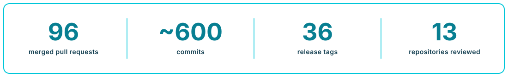
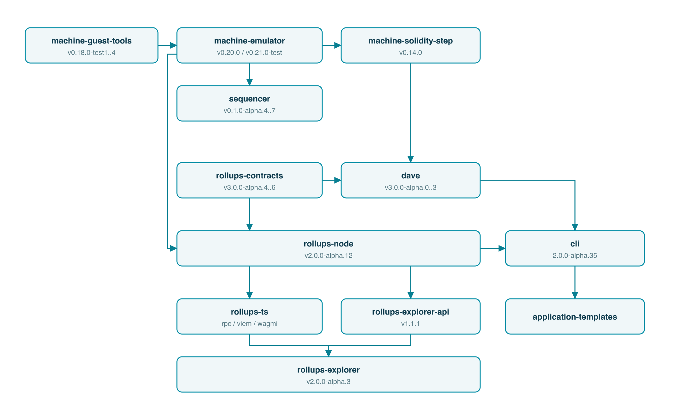

# Cartesi Technical Evolution Report - Q2 2026

**Window:** 1 April – 30 June 2026
**Scope:** Cartesi Rollups stack and related components

**In this report**

1. [Summary](#summary)
2. [Q2 in Numbers](#q2-in-numbers)
3. [Pillar 1: Safe Infrastructure for Real Money](#pillar-1-safe-infrastructure-for-real-money)
4. [Pillar 2: Economical Computation at Scale](#pillar-2-economical-computation-at-scale)
5. [Pillar 3: Easy Stack for Shipping Onchain in a Day](#pillar-3-easy-stack-for-shipping-onchain-in-a-day)
6. [How the stack interlocks](#how-the-stack-interlocks)
7. [Appendix A: GitHub activity](#appendix-a-github-activity)
8. [Appendix B: Delivery ledger](#appendix-b-q2-2026-delivery-ledger)
9. [Appendix C: Releases by product](#appendix-c-q2-2026-releases)

---

## Summary

Q2 2026 is reported against the three current technical priorities in the Technical Evolution Plan. The quarter focused on moving the stack toward coordinated releases, improving infrastructure resilience, and making the developer experience easier to use.

**Safe Infrastructure for Real Money.** Emergency withdrawal became usable without operator cooperation, while the Fraud-Proof System continued through its experimental track. The quarter also advanced the hardening and integration work needed to support safer operation of the stack.

**Economical Computation at Scale.** Machine Emulator v0.20 shipped and became the integration anchor for the rest of the stack. The sequencer also became significantly more resilient, with improvements focused on recovery and operational reliability.

**Easy Stack for Shipping Onchain in a Day.** The rollups node, SDK, explorer, and CLI moved onto a coordinated alpha release sequence. The developer surface was also extended with machine-readable documentation, Cartesi AI skill packs, and an MCP server, alongside DeFi examples demonstrating application prototypes.

Q2 closed with the stack aligned around coordinated releases. Q3 will focus on stabilising that progress and making it ready for broader operator and developer use.

---

## Q2 in Numbers

The following Github activity highlights the evidence of the work across the official repositories reviewed this quarter.

---

## Pillar 1: Safe Infrastructure for Real Money

### Objective

Financial applications need recovery paths and dispute resolution that hold under adversarial conditions.

In Q2, the objective was to enable users to recover assets when an application stops operating and maintain compatibility between the dispute system and the contracts that settle its results.

### Key Q2 Deliveries

**Emergency Withdrawals.** Emergency withdrawal work made it possible for users to recover funds without relying on the application operator. Claims are now staged before they take effect, account validity proofs are substantially smaller, and owner privileges are revoked when an application is foreclosed. Together, these changes make withdrawal more practical and reduce the risks around a failed application.

[Claim staging](https://github.com/cartesi/rollups-contracts/pull/514) changes when a claim takes effect. A claim submitted by an Authority owner or a Quorum majority used to apply immediately. It is now marked staged and can be accepted only after a staging period elapses, which gives observers time to detect a fraudulent or mistaken claim before it becomes final.

[Smaller account validity proofs](https://github.com/cartesi/rollups-contracts/pull/515) split account validation into two steps. Each user previously supplied a full proof from their account root to the machine root. After foreclosure, the accounts-drive Merkle root is proved once against the last-finalised machine root, and each account is validated against that already-proved root. For an application supporting 2^17 accounts, the user-supplied proof drops from 59 elements to 17. The user needs the account recovery state, which is enough for a withdrawal interface to run in a browser. The first, shared proof is supplied once for the application. An event records that the accounts-drive root has been proved, so an interface can see that this step is done.

[Foreclosure hardening](https://github.com/cartesi/rollups-contracts/pull/522) disables application owner privileges when an application is foreclosed. A withdrawal-config getter was added, and the application address is passed through to `buildWithdrawalOutput`.

The same flow is exposed by the contracts, node, CLI, emulator, and explorer. Claim staging landed in the contracts. The node adopted the contracts 3.0.0 alpha line. The CLI exposes the staging period in its run and deploy flow. The explorer disables Send for a foreclosed application and shows the reason on the application and epoch status views.

**Fraud-Proof System v3.** Multiple `v3.0.0-alpha` [releases](https://github.com/cartesi/dave/releases) kept the fraud-proof system aligned with the contracts it settles against. Settlement exposes the last finalized machine root that an emergency withdrawal proves against, and `settle` reverts when the application is foreclosed. Deployment addresses are pre-computed for every chain and published with the release. A [PRT reentrancy issue](https://github.com/cartesi/dave/pull/259) was fixed. The experimental component was [added to the SDK](https://github.com/cartesi/cli/pull/491), so it ships with the developer tools.

**Auditing and Battle Testing.** Q2 included in-house reviews of successive node, contracts, and CLI release candidates under the current Authority/single-operator trust model. Coverage included the input pipeline, execution and determinism, the claim and settlement lifecycle, emergency withdrawal, asset portals, node availability, and the public query API. Findings were triaged and addressed internally.

Additional hardening covered the sequencer, emulator, node, CI, and fund-handling paths. Sequencer recovery is specified in TLA+ for the optimistic and preemptive models, with a documented threat model and invariants. [Emulator fuzzing](https://github.com/cartesi/machine-emulator/pull/363) exercises the core execution environment, and the bugs it found were fixed. CI actions on the emulator, Solidity step, and Dave are pinned by digest, which binds each workflow to a specific action revision. [HTTP hardening](https://github.com/cartesi/rollups-node/pull/774) and the claim and foreclosure fixes sit on the same pass. The goal was to identify failures and attack paths before these components are relied on for real funds.

### Why it Matters

These deliveries are a trust-enabling measure for live applications that hold real funds: recovery has to remain usable when the normal application workflow fails. Claim staging leaves a window in which a bad claim can be seen before it is final. The smaller account proof cuts what each user submits and makes a browser withdrawal practical. Foreclosure removes owner privileges from a failed application. Fraud-proof releases tracked the settlement contracts version for version, which is what lets a dispute resolve under the rules the application uses.

### Next Milestone

Emergency Withdrawals still require support for **deposit refunds**, extending recovery to deposits that were received but not yet processed when an application is foreclosed.

Fraud-Proof System v3 remains experimental, with the next milestone focused on integrating and hardening dispute resolution across the full Rollups stack. **Validator diversity** is also a priority, reducing reliance on a single validator implementation and limiting the impact of implementation-specific bugs.

---

## Pillar 2: Economical Computation at Scale

### Objective

Real financial logic has to be cheap enough to run every block, and interactive applications cannot wait minutes for L1 finality on every user action.

In Q2, the objective was to advance the execution engine the rest of the stack depends on, and to make the sequencer resilient enough to provide faster confirmations for better UX.

### Key Q2 Deliveries

**Machine Emulator.** `machine-emulator` [v0.20.0](https://github.com/cartesi/machine-emulator/releases/tag/v0.20.0) shipped and became the base version for the Q2 development line. The release replaced the Merkle tree with a faster hash tree supporting Keccak-256 and SHA-256, accelerated with SIMD and multithreading and cached on disk. Machines can keep their state fully on disk across every address range, and clone that state with reflinks or hardlinks on copy-on-write filesystems. A bulk hash API collects root hashes at configurable intervals and bundles subtrees, so a computation hash can be built over a long execution. These are the capabilities the rollups node and Dave integrate against. The `v0.21.0` test releases continued on the same line. The quarter also added [NVRAM support](https://github.com/cartesi/machine-emulator/pull/380), allowing applications to preserve their state more efficiently between inputs by reducing the overhead of synchronising state through the operating system. Distribution across package managers was expanded, and [fuzz testing](https://github.com/cartesi/machine-emulator/pull/363) was introduced for the emulator. 

Emergency withdrawal needs proofs that stay valid when some inputs were rejected. Revert-root-hash accessors were added across the C, Lua, and JSON-RPC APIs. The hash is recorded in `send_cmio_response`, substituted when hashes are collected over rejected inputs, and emitted as a per-output proof from `--cmio-advance-state`, including a proof that the output-hashes root sits in the accepting state.

The [Solidity step](https://github.com/cartesi/machine-solidity-step/releases/tag/v0.14.0) `v0.14.0` combined the interpreter checkpoint, added coverage for the step, and renamed `checkpoint-hash` to `revert-root-hash`, so the on-chain step uses the same root the emulator records. Guest tools moved through four `v0.18.0` test releases. These are the components that reproduce and verify machine execution, and they stayed aligned with the emulator.

**ZK Verification Path.** Q2 continued exploration of a zero-knowledge path for verifying Cartesi Machine state transitions, using a [RISC Zero integration](https://github.com/cartesi/machine-emulator/tree/v0.20.0/risc0) inside the machine emulator. Given a step log, the same access log used by fraud-proof bisection, the pipeline proves that the transition from `root_hash_before`, over `mcycle_count` cycles, to `root_hash_after` is valid. A freestanding RISC-V guest replays the logged step inside the zkVM and writes an ABI-encoded journal. The host prover verifies that receipt and compresses it to a Groth16 seal. `CartesiStepVerifier` submits the seal to the RISC Zero verifier and checks the journal against the expected hashes and cycle count. Interactive bisection and this path both verify the same state transition; the zk path does it in one on-chain check.

Q2 kept that experimental integration aligned with the emulator: dependency bumps in the Rust guest and host, a locked toolchain install in CI, and verify-API refactors shared with the rest of the emulator. The RISC Zero toolchain is documented as an optional build dependency of the official packages.

**Confirmation Latency.** The sequencer is the path for faster confirmation than waiting for L1 finality. It accepts signed user operations, confirms them immediately, and posts them to L1 in batches. The off-chain sequencer and the on-chain scheduler have to produce the same execution order, and the operator has to be able to detect and recover from failure.

Recovery from [stale batches](https://github.com/cartesi/sequencer/pull/12) addresses a specific cascade. When a batch reaches L1 too late, the scheduler skips it. That skip poisons the nonce counter, and every later batch becomes unreachable. The sequencer detects the approach of that window, goes offline, flushes the L1 mempool so a delayed submission cannot land afterwards, and cascade-invalidates the doomed chain. TLA+ specifications for the optimistic and preemptive recovery models are part of the design.

Restart from [snapshots](https://github.com/cartesi/sequencer/pull/13) dumps application state when a batch closes, promotes the dump to finalised when L1 confirms it, and garbage-collects older dumps. At startup the sequencer loads the latest snapshot and replays the persisted transaction stream from that offset. The watchdog and Cockroach recovery both read these snapshots.

[Cockroach recovery](https://github.com/cartesi/sequencer/pull/18) covers a lost or irrecoverably diverged local database, when there is no batch tree left to repair. The operator wipes the data directory and rebuilds canonical state from a trusted checkpoint by folding L1 forward. The fold runs the same scheduler source compiled into the on-chain machine, so the rebuild follows L1.

The [watchdog](https://github.com/cartesi/sequencer/pull/14) is an independent process. It reads the sequencer's finalised state and compares it with the canonical Cartesi Machine at the same L1 inclusion block. On the reference application that comparison uses the machine's `inspect` output. A mismatch produces a structured event and exits. The process does not retry, because a deterministic mismatch is a settled divergence. The check recomputes state from the canonical machine. The watchdog image is published to GHCR and Docker Hub, versioned to the sequencer release, so operators deploy a matched bundle.

Soft confirmations are an optimistic prediction. Divergence becomes visible when the offending batch reaches L1 safe finality, a window of about two epochs. Confirmations issued inside that window can rest on state that has already diverged. That bound belongs to the optimistic model.

These capabilities cover the main failure modes of operating a sequencer. The sequencer was tested against a reference wallet application. Deployment tooling and an operator runbook cover staging, recovery, the threat model, and invariants.

### Why it Matters

The Machine Emulator is the execution foundation for the Rollups stack. Fuzzing and the shared revert-root hash keep independent implementations and the on-chain step on the same machine state. Improving execution efficiency makes complex application logic more practical to run while keeping it verifiable and aligned across the stack.

The sequencer provides fast soft confirmations ahead of fraud-proof settlement, reducing confirmation latency for trading and other responsive applications. Recovery from stale batches, restart from snapshots, the watchdog, and Cockroach rebuild are what make that faster path operable after failure. Confirmations stay optimistic until the batch reaches L1 safe finality.

### Next Milestone

The next milestone for **confirmation latency** is deploying the sequencer to a live testnet, where applications can begin testing fast soft confirmations alongside fraud-proof settlement.

**Machine Emulator** development will continue beyond v0.20, with a focus on improving the efficiency of application computation and establishing the next machine version that the rest of the Rollups stack can integrate against.

---

## Pillar 3: Easy Stack for Shipping Onchain in a Day

### Objective

In Q2, the objective was to ship the rollups node, SDK, explorer, and CLI as a compatible alpha set for early testers, so developers and coding agents can build rollup applications quickly, using the languages, libraries, and tools they already know.

### Key Q2 Deliveries

**Rollups Node v2.** `rollups-node` absorbed the [contracts v3 alpha line](https://github.com/cartesi/rollups-node/pull/779) and shipped [v2.0.0-alpha.12](https://github.com/cartesi/rollups-node/releases/tag/v2.0.0-alpha.12) on emulator v0.20.0. That release is the integration point for the rest of the stack. The SDK, explorer, and CLI then followed in that order, each consuming the release before it. Authority, Quorum, and PRT applications can be foreclosed so users withdraw from the proved accounts drive. The node records foreclosure, drive-proof, and withdrawal events and serves them over JSON-RPC. A foreclosed PRT application drains unfinished epochs to a terminal state.

The node also received security and reliability improvements. The [EVM reader](https://github.com/cartesi/rollups-node/pull/781) now polls for blocks. Under WebSocket notifications, a block that took longer to process than the block time left a queue of stale notifications, and the reader worked through them one by one. Polling reads the latest block and clears that backlog. `[rollups-ts](https://github.com/cartesi/rollups-ts)` updated its RPC types against the upcoming node API, so the TypeScript clients were ready when `alpha.12` shipped.

**CLI 2.0 and Rollups Explorer.** The CLI added support for the new [emergency-withdrawal flow](https://github.com/cartesi/cli/pull/486): a claim staging period in run and deploy, withdrawal configuration setup, and deployment of the withdrawal output builder on devnet. Deployment addresses are chain-independent and shipped as artifacts, so the same contract sits at the same address on every chain. Other deployment workflows moved with the node `alpha.12` release.

The explorer added foreclosure state on the application and epoch views. Sending inputs is disabled for [foreclosed applications](https://github.com/cartesi/rollups-explorer/pull/466), and the interface states the reason.

**Agentic Development.** Cartesi [documentation](https://docs.cartesi.io/cartesi-rollups/2.0/build-with-ai/overview/) became easier for AI coding agents to consume. The site serves `llms.txt` and `llms-full.txt` indexes, a `.md` URL for every page. The Build with AI section adds a copy-page action, a spec-driven development prompt, and setup notes for Codex, Claude Desktop, and VS Code.

`[cartesi-skills](https://github.com/Mugen-Builders/cartesi-skills)` `v0.1.0` added eleven skill packs: scaffolding, backend core with separate Python and JS/TS variants, contracts, frontend, local development, deployment, JSON-RPC, and debugging, plus a workflow pack that routes an agent to the right pack. Each pack is pinned to explicit versions and was later updated for the contracts v3 lifecycle and node `alpha.12`.

An [MCP server](https://github.com/Mugen-Builders/MCP-Server) exposes that material through the Model Context Protocol. It serves skills and article bodies directly to the agent, with deposit-instruction tools for ETH, ERC-20, ERC-721, and ERC-1155, a configurable depositor wallet, and search that answers natural-language queries. An admin interface maintains articles and skills as the SDK changes.

The goal is to give developers and coding agents a consistent source of Cartesi-specific knowledge and workflows, drawn from the documentation, the skill packs, and the MCP server.

**Demo DeFi Implementations.** A set of DeFi demos and tutorials showed how the Linux-based Cartesi Machine can run familiar onchain workloads in ordinary languages.

[Liquidity management](https://github.com/Mugen-Builders/cartesi-uniswap-integration) uses a vault contract that turns idle deposits into active Uniswap liquidity, run end to end on Base Sepolia. [Data processing](https://github.com/Mugen-Builders/pandas-example) runs Pandas over application state inside the machine. Companion examples cover a [NumPy risk model](https://x.com/cartesiproject/status/2055273057129058719) for lending and borrowing positions, a [bonding curve](https://x.com/cartesiproject/status/2060346474551185423) for token issuance, a [Chainlink price feed](https://x.com/riseandshaheen/status/2047247344828395616) wired into an application, and [financial modeling](https://x.com/joaopdgarcia/status/2067601502110179709) such as Black-Scholes and Monte Carlo simulation. [Combinatorial markets](https://x.com/cartesiproject/status/2069410399909564883) run deterministic probabilistic inference so correlated outcomes are priced as one market.

These examples provide working references for developers evaluating what can be built with Cartesi, and they exercise the stack on applications past the basic tutorials.

### Why it Matters

A developer building a rollup application should not have to create the infrastructure around it. The rollups node, CLI, explorer, and clients ship as one compatible alpha set, in dependency order from node `alpha.12` through the SDK, explorer, and CLI, so the developer can focus on application logic.

Agent-readable documentation, version-pinned skill packs, and the MCP server give coding agents the procedures and API surface those releases shipped.

### Next Milestone

The next coordinated releases of the rollups node, SDK, explorer, and CLI will integrate the next Machine Emulator version, keeping the stack aligned and providing early testers with a compatible development environment.

Node development will continue to improve multi-application throughput, restart resilience, and operational diagnostics. Client libraries will also be simplified to provide application developers with a clearer TypeScript interface for interacting with Cartesi Rollups.

---

## How the stack interlocks

The diagram shows how Q2 releases depended on one another, from the machine through settlement and the node to the developer tools. Contracts and Dave versioned together, the node was the integration point for the SDK, explorer and CLI, and the sequencer pinned the emulator on its own track.

---

## Appendix A: GitHub activity

Breakdown by repository. Headline figures are in [Q2 in Numbers](#q2-in-numbers).

| Repository              | Merged PRs | Primary branch used   | Q2 releases |
| ----------------------- | ---------- | --------------------- | ----------- |
| `rollups-contracts`     | 16         | `next/3.0`            | 3           |
| `cli`                   | 15         | `prerelease/v2-alpha` | 6           |
| `rollups-explorer`      | 11         | `main`                | 1           |
| `rollups-node`          | 10         | `next/2.0`            | 1           |
| `dave`                  | 10         | `next/3.0`            | 4           |
| `sequencer`             | 9          | `main`                | 4           |
| `machine-solidity-step` | 8          | `main`                | 1           |
| `machine-emulator`      | 7          | `main`                | 5           |
| `rollups-ts`            | 5          | `prerelease/v2-alpha` | 6           |
| `application-templates` | 3          | `prerelease/sdk-12`   | 0           |
| `machine-guest-tools`   | 1          | `main`                | 4           |
| `rollups-explorer-api`  | 1          | `main`                | 1           |
| `honeypot`              | 0          | n/a                   | 0           |

---

## Appendix B: Q2 2026 delivery ledger

Complete list of pull requests merged between 1 April and 30 June 2026. This is the evidence backing the report above; pull-request references are concentrated here rather than inlined throughout the body. The **Pillar** column uses the TEP headings: Safe (Safe Infrastructure for Real Money), Econ (Economical Computation at Scale), Easy (Easy Stack for Shipping Onchain in a Day).

| Date   | Repository            | PR                                                                                                                                                                                       | Title                                              | Pillar |
| ------ | --------------------- | ---------------------------------------------------------------------------------------------------------------------------------------------------------------------------------------- | -------------------------------------------------- | ------ |
| 01 Apr | sequencer             | [#11](https://github.com/cartesi/sequencer/pull/11)                                                                                                                                      | Log space fees, e2e tests and benchmarks           | Econ   |
| 07 Apr | dave                  | [#259](https://github.com/cartesi/dave/pull/259)                                                                                                                                         | Avoid reentrancy attacks on PRT                    | Safe   |
| 07 Apr | rollups-explorer      | [#449](https://github.com/cartesi/rollups-explorer/pull/449)                                                                                                                             | Add outputs list page                              | Easy   |
| 08 Apr | dave                  | [#260](https://github.com/cartesi/dave/pull/260)                                                                                                                                         | Custom errors and Rollups contracts bump           | Safe   |
| 08 Apr | application-templates | [#81](https://github.com/cartesi/application-templates/pull/81)                                                                                                                          | Bump ubuntu baseimage to noble-20260324            | Easy   |
| 08 Apr | application-templates | [#82](https://github.com/cartesi/application-templates/pull/82)                                                                                                                          | Bump @cartesi/cli to v2.0.0-alpha.34               | Easy   |
| 09 Apr | machine-guest-tools   | [#103](https://github.com/cartesi/machine-guest-tools/pull/103)                                                                                                                          | Fix generated libcmt ffi.h                         | Econ   |
| 09 Apr | machine-emulator      | [#355](https://github.com/cartesi/machine-emulator/pull/355)                                                                                                                             | Release v0.20.0                                    | Econ   |
| 09 Apr | machine-emulator      | [#363](https://github.com/cartesi/machine-emulator/pull/363)                                                                                                                             | Add fuzzer harness and fix bugs it found           | Econ   |
| 09 Apr | machine-emulator      | [#365](https://github.com/cartesi/machine-emulator/pull/365)                                                                                                                             | Cache shadow register page in replay               | Econ   |
| 10 Apr | machine-solidity-step | [#85](https://github.com/cartesi/machine-solidity-step/pull/85)                                                                                                                          | Combine interpreter checkpoint                     | Econ   |
| 10 Apr | machine-solidity-step | [#89](https://github.com/cartesi/machine-solidity-step/pull/89)                                                                                                                          | Coverage for solidity step                         | Econ   |
| 10 Apr | machine-solidity-step | [#91](https://github.com/cartesi/machine-solidity-step/pull/91)                                                                                                                          | Bump Ubuntu to 24.04                               | Econ   |
| 10 Apr | machine-solidity-step | [#92](https://github.com/cartesi/machine-solidity-step/pull/92)                                                                                                                          | CI bump and lock actions digest                    | Safe   |
| 11 Apr | machine-solidity-step | [#88](https://github.com/cartesi/machine-solidity-step/pull/88)                                                                                                                          | Rename checkpoint-hash to revert-root-hash         | Safe   |
| 13 Apr | machine-emulator      | [#373](https://github.com/cartesi/machine-emulator/pull/373)                                                                                                                             | Rename many files                                  | Econ   |
| 13 Apr | rollups-explorer      | [#452](https://github.com/cartesi/rollups-explorer/pull/452)                                                                                                                             | Improve data fetch error and connectivity          | Easy   |
| 13 Apr | machine-solidity-step | [#90](https://github.com/cartesi/machine-solidity-step/pull/90)                                                                                                                          | Release v0.14.0                                    | Econ   |
| 13 Apr | machine-solidity-step | [#94](https://github.com/cartesi/machine-solidity-step/pull/94)                                                                                                                          | Bump Solidity, forge-std and Foundry               | Econ   |
| 14 Apr | machine-emulator      | [#375](https://github.com/cartesi/machine-emulator/pull/375)                                                                                                                             | Early rejection of commits by CI                   | Safe   |
| 14 Apr | machine-solidity-step | [#97](https://github.com/cartesi/machine-solidity-step/pull/97)                                                                                                                          | CI lock missing upload artifact action             | Safe   |
| 15 Apr | machine-emulator      | [#378](https://github.com/cartesi/machine-emulator/pull/378)                                                                                                                             | CI lock actions digests                            | Safe   |
| 16 Apr | rollups-contracts     | [#496](https://github.com/cartesi/rollups-contracts/pull/496)                                                                                                                            | Add version getter                                 | Safe   |
| 16 Apr | rollups-node          | [#773](https://github.com/cartesi/rollups-node/pull/773)                                                                                                                                 | Fixes on service logs and help output              | Easy   |
| 22 Apr | rollups-contracts     | [#506](https://github.com/cartesi/rollups-contracts/pull/506)                                                                                                                            | Convert error strings into custom errors           | Safe   |
| 22 Apr | rollups-node          | [#774](https://github.com/cartesi/rollups-node/pull/774)                                                                                                                                 | HTTP hardening                                     | Easy   |
| 27 Apr | dave                  | [#263](https://github.com/cartesi/dave/pull/263)                                                                                                                                         | Fix emulator binding json schema                   | Safe   |
| 27 Apr | rollups-contracts     | [#514](https://github.com/cartesi/rollups-contracts/pull/514)                                                                                                                            | **Claim staging**                                  | Safe   |
| 28 Apr | dave                  | [#241](https://github.com/cartesi/dave/pull/241)                                                                                                                                         | Bump emulator to 0.20                              | Safe   |
| 28 Apr | machine-emulator      | [#380](https://github.com/cartesi/machine-emulator/pull/380)                                                                                                                             | Implement the new NVRAM option                     | Econ   |
| 29 Apr | cli                   | [#464](https://github.com/cartesi/cli/pull/464)                                                                                                                                          | Bump docker actions                                | Easy   |
| 29 Apr | rollups-contracts     | [#515](https://github.com/cartesi/rollups-contracts/pull/515)                                                                                                                            | **Smaller account validity proof**                 | Safe   |
| 05 May | rollups-contracts     | [#500](https://github.com/cartesi/rollups-contracts/pull/500)                                                                                                                            | Version Packages (alpha)                           | Safe   |
| 05 May | rollups-contracts     | [#516](https://github.com/cartesi/rollups-contracts/pull/516)                                                                                                                            | Fix Quorum NotFirstClaim on resubmission           | Safe   |
| 06 May | dave                  | [#264](https://github.com/cartesi/dave/pull/264)                                                                                                                                         | Bump rollups-contracts to 3.0.0-alpha.4            | Safe   |
| 06 May | dave                  | [#265](https://github.com/cartesi/dave/pull/265)                                                                                                                                         | Bump Debian and Boost on CI and Dockerfile         | Safe   |
| 06 May | rollups-explorer      | [#450](https://github.com/cartesi/rollups-explorer/pull/450), [#453](https://github.com/cartesi/rollups-explorer/pull/453), [#456](https://github.com/cartesi/rollups-explorer/pull/456) | Dependency bumps (vite, next, postcss)             | Easy   |
| 07 May | rollups-node          | [#720](https://github.com/cartesi/rollups-node/pull/720)                                                                                                                                 | Bump emulator to v0.20.0                           | Easy   |
| 14 May | rollups-explorer      | [#454](https://github.com/cartesi/rollups-explorer/pull/454)                                                                                                                             | Add test framework                                 | Easy   |
| 15 May | rollups-contracts     | [#519](https://github.com/cartesi/rollups-contracts/pull/519)                                                                                                                            | Chain-independent deployment addresses             | Easy   |
| 15 May | rollups-contracts     | [#521](https://github.com/cartesi/rollups-contracts/pull/521)                                                                                                                            | Add withdrawal-config getter                       | Safe   |
| 18 May | rollups-explorer      | [#455](https://github.com/cartesi/rollups-explorer/pull/455)                                                                                                                             | Bump uuid                                          | Easy   |
| 18 May | rollups-contracts     | [#522](https://github.com/cartesi/rollups-contracts/pull/522)                                                                                                                            | Disable app owner privileges upon foreclosure      | Safe   |
| 18 May | rollups-contracts     | [#523](https://github.com/cartesi/rollups-contracts/pull/523)                                                                                                                            | Pass app address to buildWithdrawalOutput          | Safe   |
| 19 May | sequencer             | [#12](https://github.com/cartesi/sequencer/pull/12)                                                                                                                                      | **Recovery for stale batches**                     | Econ   |
| 19 May | dave                  | [#267](https://github.com/cartesi/dave/pull/267)                                                                                                                                         | Prepare for alpha release                          | Safe   |
| 19 May | rollups-contracts     | [#520](https://github.com/cartesi/rollups-contracts/pull/520)                                                                                                                            | Version Packages (alpha)                           | Safe   |
| 19 May | rollups-contracts     | [#524](https://github.com/cartesi/rollups-contracts/pull/524)                                                                                                                            | Distribute deterministic deployment addresses      | Easy   |
| 19 May | rollups-node          | [#777](https://github.com/cartesi/rollups-node/pull/777)                                                                                                                                 | Pre-clean snapshot dir before store                | Easy   |
| 21 May | dave                  | [#268](https://github.com/cartesi/dave/pull/268)                                                                                                                                         | Bump rollups-contracts to 3.0.0-alpha.6            | Safe   |
| 21 May | rollups-contracts     | [#526](https://github.com/cartesi/rollups-contracts/pull/526)                                                                                                                            | Event for accounts drive Merkle root proved        | Safe   |
| 21 May | rollups-contracts     | [#527](https://github.com/cartesi/rollups-contracts/pull/527)                                                                                                                            | Version Packages (alpha)                           | Safe   |
| 22 May | rollups-ts            | [#120](https://github.com/cartesi/rollups-ts/pull/120)                                                                                                                                   | Upgrade rollups contracts                          | Easy   |
| 26 May | cli                   | [#478](https://github.com/cartesi/cli/pull/478)                                                                                                                                          | Devnet rollups contracts upgrade                   | Easy   |
| 27 May | cli                   | [#481](https://github.com/cartesi/cli/pull/481)                                                                                                                                          | Devnet sequential tasks and exit on error          | Easy   |
| 01 Jun | sequencer             | [#15](https://github.com/cartesi/sequencer/pull/15)                                                                                                                                      | Snapshot capability (continued)                    | Econ   |
| 02 Jun | sequencer             | [#13](https://github.com/cartesi/sequencer/pull/13)                                                                                                                                      | Add snapshot capability                            | Econ   |
| 02 Jun | application-templates | [#83](https://github.com/cartesi/application-templates/pull/83)                                                                                                                          | Bump ubuntu baseimage to noble-20260410            | Easy   |
| 03 Jun | rollups-explorer      | [#461](https://github.com/cartesi/rollups-explorer/pull/461)                                                                                                                             | Bump turbo                                         | Easy   |
| 09 Jun | rollups-ts            | [#123](https://github.com/cartesi/rollups-ts/pull/123)                                                                                                                                   | Update RPC types for upcoming node API             | Easy   |
| 09 Jun | rollups-explorer      | [#463](https://github.com/cartesi/rollups-explorer/pull/463)                                                                                                                             | Bump vitest                                        | Easy   |
| 09 Jun | rollups-contracts     | [#533](https://github.com/cartesi/rollups-contracts/pull/533)                                                                                                                            | **Prepare for deposit refunds**                    | Safe   |
| 11 Jun | cli                   | [#486](https://github.com/cartesi/cli/pull/486)                                                                                                                                          | Deploy withdrawal output builder                   | Safe   |
| 11 Jun | rollups-node          | [#779](https://github.com/cartesi/rollups-node/pull/779)                                                                                                                                 | **Bump contracts 3.0.0 alpha**                     | Easy   |
| 11 Jun | rollups-node          | [#783](https://github.com/cartesi/rollups-node/pull/783)                                                                                                                                 | Improve json-rpc spec                              | Easy   |
| 16 Jun | rollups-ts            | [#124](https://github.com/cartesi/rollups-ts/pull/124)                                                                                                                                   | Add latest json-rpc api changes                    | Easy   |
| 16 Jun | rollups-node          | [#778](https://github.com/cartesi/rollups-node/pull/778)                                                                                                                                 | Validator hardening                                | Easy   |
| 17 Jun | rollups-node          | [#781](https://github.com/cartesi/rollups-node/pull/781)                                                                                                                                 | EVM reader polls instead of WebSocket              | Easy   |
| 17 Jun | rollups-node          | [#782](https://github.com/cartesi/rollups-node/pull/782)                                                                                                                                 | Update go version and dependencies                 | Easy   |
| 18 Jun | cli                   | [#479](https://github.com/cartesi/cli/pull/479)                                                                                                                                          | SDK machine emulator bump                          | Easy   |
| 18 Jun | cli                   | [#491](https://github.com/cartesi/cli/pull/491)                                                                                                                                          | **Add PRT binary to nitro**                        | Safe   |
| 19 Jun | dave                  | [#266](https://github.com/cartesi/dave/pull/266)                                                                                                                                         | CI lock GH actions by digest                       | Safe   |
| 22 Jun | sequencer             | [#14](https://github.com/cartesi/sequencer/pull/14)                                                                                                                                      | **Watchdog v1 (compare mode)**                     | Econ   |
| 22 Jun | sequencer             | [#16](https://github.com/cartesi/sequencer/pull/16)                                                                                                                                      | Harden watchdog for production                     | Econ   |
| 22 Jun | dave                  | [#269](https://github.com/cartesi/dave/pull/269)                                                                                                                                         | Remove unused Cannon and pnpm dependency           | Safe   |
| 22 Jun | rollups-explorer      | [#464](https://github.com/cartesi/rollups-explorer/pull/464)                                                                                                                             | Upgrade to node alpha.12, app/epoch status UI      | Easy   |
| 22 Jun | rollups-explorer      | [#466](https://github.com/cartesi/rollups-explorer/pull/466)                                                                                                                             | **Gated Send Tx for foreclosed applications**      | Safe   |
| 22 Jun | rollups-contracts     | [#535](https://github.com/cartesi/rollups-contracts/pull/535)                                                                                                                            | Refactor and address issues #493, #530, #532, #534 | Safe   |
| 24 Jun | sequencer             | [#17](https://github.com/cartesi/sequencer/pull/17)                                                                                                                                      | Publish watchdog image to GHCR and Docker Hub      | Econ   |
| 24 Jun | cli                   | [#489](https://github.com/cartesi/cli/pull/489)                                                                                                                                          | **Support node alpha.12**                          | Easy   |
| 24 Jun | cli                   | [#494](https://github.com/cartesi/cli/pull/494)                                                                                                                                          | Add QEMU and buildx setup actions                  | Easy   |
| 25 Jun | rollups-explorer-api  | [#63](https://github.com/cartesi/rollups-explorer-api/pull/63)                                                                                                                           | Add archive gateway authentication                 | Easy   |
| 26 Jun | rollups-node          | [#784](https://github.com/cartesi/rollups-node/pull/784)                                                                                                                                 | Integration test sharding                          | Easy   |
| 29 Jun | sequencer             | [#19](https://github.com/cartesi/sequencer/pull/19)                                                                                                                                      | Align env var names with rollups-node              | Econ   |
| 30 Jun | sequencer             | [#18](https://github.com/cartesi/sequencer/pull/18)                                                                                                                                      | **"Cockroach" recovery**                           | Econ   |
| 30 Jun | cli                   | [#496](https://github.com/cartesi/cli/pull/496)                                                                                                                                          | address-book prints a single contract address      | Easy   |

Automated release-versioning pull requests (`Version Packages (alpha)`) in `cli` and `rollups-ts` are omitted from the table; they are counted in the totals.

---

## Appendix C: Q2 2026 releases

### Cartesi Machine (emulator, solidity step, guest tools)

| Product                   | Releases                                                              |
| ------------------------- | --------------------------------------------------------------------- |
| **machine-emulator**      | `v0.20.0` · `v0.21.0-test1` · `v0.21.0-test2` · `v0.21.0-test3`       |
| **machine-solidity-step** | `v0.14.0`                                                             |
| **machine-guest-tools**   | `v0.18.0-test1` · `v0.18.0-test2` · `v0.18.0-test3` · `v0.18.0-test4` |

### Settlement and fraud proofs (contracts, Dave)

| Product               | Releases                                                                  |
| --------------------- | ------------------------------------------------------------------------- |
| **rollups-contracts** | `v3.0.0-alpha.4` · `v3.0.0-alpha.5` · `v3.0.0-alpha.6`                    |
| **dave**              | `v3.0.0-alpha.0` · `v3.0.0-alpha.1` · `v3.0.0-alpha.2` · `v3.0.0-alpha.3` |

### Node and sequencer

| Product          | Releases                                                                  |
| ---------------- | ------------------------------------------------------------------------- |
| **rollups-node** | `v2.0.0-alpha.12`                                                         |
| **sequencer**    | `v0.1.0-alpha.4` · `v0.1.0-alpha.5` · `v0.1.0-alpha.6` · `v0.1.0-alpha.7` |

### Developer SDK and tooling (CLI, TypeScript, templates)

| Product                         | Releases                                               |
| ------------------------------- | ------------------------------------------------------ |
| **@cartesi/cli**                | `2.0.0-alpha.35`                                       |
| **@cartesi/sdk**                | `0.12.0-alpha.40` · `0.12.0-alpha.41`                  |
| **@cartesi/devnet**             | `2.0.0-alpha.12` · `2.0.0-alpha.13` · `2.0.0-alpha.14` |
| **@cartesi/rpc · viem · wagmi** | alpha releases                                         |

### Explorer

| Product                  | Releases         |
| ------------------------ | ---------------- |
| **rollups-explorer**     | `v2.0.0-alpha.3` |
| **rollups-explorer-api** | `v1.1.1`         |

The node → SDK → explorer → CLI cluster, on an emulator `v0.20.0` base, is the convergence described in Pillar 3. The `v0.21.0` test line, the sequencer, and the explorer-api released on independent tracks.

---

## Scope limitations

Documentation work in `[cartesi/docs](https://github.com/cartesi/docs)` is kept out of the GitHub activity numbers in the appendices, and the relevant work is included in Pillar 3.

Some releases tagged in this quarter include work from pull requests merged in a previous quarter. Those pull requests are not included in the GitHub activity numbers or the delivery ledger. The release tag is counted when it falls inside the window.

[Mugen-Builders](https://github.com/Mugen-Builders) work on skills and the MCP server is managed by the Developer Advocacy Unit. It is described in Pillar 3 and is not counted in Appendices.

Execution of deployments to live networks is not recorded in these repositories and may live in operational systems outside GitHub.
