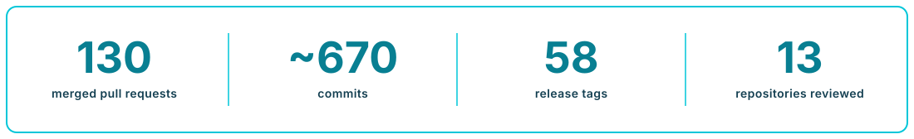
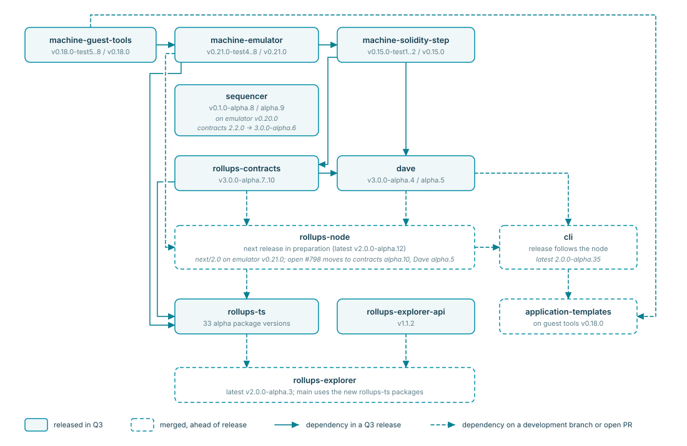

# Cartesi Technical Evolution Report - Q3 2026

**Window:** 1 July – 30 September 2026
**Scope:** Cartesi Rollups stack and related components

**In this report**

1. [Summary](#summary)
2. [Q3 in Numbers](#q3-in-numbers)
3. [Pillar 1: Safe Infrastructure for Real Money](#pillar-1-safe-infrastructure-for-real-money)
4. [Pillar 2: Economical Computation at Scale](#pillar-2-economical-computation-at-scale)
5. [Pillar 3: Easy Stack for Shipping Onchain in a Day](#pillar-3-easy-stack-for-shipping-onchain-in-a-day)
6. [How the stack interlocks](#how-the-stack-interlocks)
7. [Appendix A: GitHub activity](#appendix-a-github-activity)
8. [Appendix B: Delivery ledger](#appendix-b-q3-2026-delivery-ledger)
9. [Appendix C: Releases by product](#appendix-c-q3-2026-releases)
10. [Scope limitations](#scope-limitations)

---

## Summary

Q3 2026 is reported against the three current technical priorities in the Technical Evolution Plan. The quarter released Cartesi Machine v0.21.0 and moved settlement and fraud proofs onto it.

**Safe Infrastructure for Real Money.** Deposit refunds complete emergency withdrawal at the contract layer, and a claim must now prove that the machine has finished its epoch normally before it can be finalized. The Fraud-Proof System v3 gained claim staging, hardened bond recovery and its first operational validator, the Sling node, and continues on its alpha track.

**Economical Computation at Scale.** In Cartesi Machine v0.21.0, every input ends in a provable outcome, even in the event of exceptions or app malfunction, and applications can keep state in persistent memory (NVRAM) across inputs. The sequencer released a fee oracle and merged fail-stop handling, and is progressing through testing toward a live testnet.

**Easy Stack for Shipping Onchain in a Day.** The rollups node moved to emulator v0.21 on its development branch and laid the groundwork for a second fraud-proof validator. The TypeScript libraries were restructured and published as alpha packages, including Node.js and browser bindings for the Cartesi Machine. 

The next milestones span all three priorities. The Fraud-Proof System works toward leaving alpha, with the rollups node joining as a second validator. The sequencer moves to a live testnet that pairs fast soft confirmations with fraud-proof settlement. A coordinated node, SDK, CLI and explorer release brings deposit refunds and the v0.21 machine to developers and operators.

---

## Q3 in Numbers

The following GitHub activity highlights the evidence of the work across the official repositories reviewed this quarter.

---

## Pillar 1: Safe Infrastructure for Real Money

### Objective

Financial applications need recovery paths and dispute resolution that hold under adversarial conditions.

In Q3, the objective was to extend recovery to deposits that were not yet processed when an application stops, and to harden the Fraud-Proof System and integrate it across the stack.

### Key Q3 Deliveries

**Emergency Withdrawals: Deposit Refunds.** Foreclosure stops an application so that users can exit. Until Q3, a deposit that reached a foreclosed application without being covered by a finalized claim had no recovery path. [Deposit refunds](https://github.com/cartesi/rollups-contracts/pull/537), released in contracts [v3.0.0-alpha.7](https://github.com/cartesi/rollups-contracts/releases/tag/v3.0.0-alpha.7), close that gap: finalized deposits are recovered through the account-proof withdrawal path delivered in Q2, and unfinalized Ether, ERC-20, ERC-721 and ERC-1155 deposits can be refunded to their depositors by anyone once the application is foreclosed. Node support, which makes refunds available end to end, is in progress in [rollups-node #798](https://github.com/cartesi/rollups-node/pull/798), and the explorer added a [foreclose action](https://github.com/cartesi/rollups-explorer/pull/469) for the application's guardian and a [withdrawals view](https://github.com/cartesi/rollups-explorer/pull/473) for its next release.

**Rollups Contracts: Distribution.** From alpha.7, the `@cartesi/rollups` npm package is retired: each release ships artifacts and deterministic deployment addresses on [GitHub](https://github.com/cartesi/rollups-contracts/releases), source on [Soldeer](https://soldeer.xyz/project/cartesi-rollups-contracts) and Rust bindings on [crates.io](https://crates.io/crates/cartesi-rollups-contracts). The v3 pre-releases are deployed on the Ethereum, Arbitrum, Base and OP Sepolia testnets.

**Claim Validity.** A claim used to prove only that an outputs root belonged to the claimed machine state, not that the machine had finished the epoch normally. The [machine yield check](https://github.com/cartesi/rollups-contracts/pull/541) closes that gap: a claim now also proves that the machine yielded with its last input accepted, and takes the outputs root from that proven state. A state that halted, raised an exception or rejected its input therefore cannot be claimed under Authority or Quorum, and [Dave #282](https://github.com/cartesi/dave/pull/282) applies the same check to tournament results. If a malformed state is the only result, the application can be foreclosed and users exit through withdrawal and refunds.

**Fraud-Proof System v3.** Dave released the pre-releases [v3.0.0-alpha.4](https://github.com/cartesi/dave/releases/tag/v3.0.0-alpha.4) and [v3.0.0-alpha.5](https://github.com/cartesi/dave/releases/tag/v3.0.0-alpha.5), both built on contracts alpha.10. Dave settles disputes with PRT (Permissionless Refereed Tournaments).

[Claim staging](https://github.com/cartesi/dave/pull/270) gives PRT applications the observation window that Authority and Quorum gained in Q2. Settlement becomes two-phase, replacing the single `settle` call: a tournament result is staged first and accepted after a staging period, or immediately if every designated sentry confirms the same final state. Sentries can speed up acceptance but cannot block or change a result.

An internal review of the PRT dispute game hardened bond recovery ([#273](https://github.com/cartesi/dave/pull/273), [#274](https://github.com/cartesi/dave/pull/274)): anyone can trigger it, the winner receives its bond plus 10% of the surplus, and the rest is burned so losing Sybil bonds cannot be recycled.

**Validator Diversity.** PRT is being built toward two independent validator implementations. The [Sling node](https://github.com/cartesi/dave/pull/272) is the first operational PRT validator, now in testing and hardening on its way to production status. It rewrites Dave's Rust validator around one engine for both input execution and dispute recomputation, which were previously separate implementations that could diverge, and [runs on emulator v0.21.0](https://github.com/cartesi/dave/pull/276). The Go rollups node is being prepared as the second validator: [deterministic input outcomes](https://github.com/cartesi/rollups-node/pull/794) and the [state proofs](https://github.com/cartesi/rollups-node/pull/795) the new claim format requires are merged on its development branch, and dispute participation is in progress in [#798](https://github.com/cartesi/rollups-node/pull/798).

**Auditing and Battle Testing.** Q3 security assurance combined internal reviews, agentic (AI-assisted) validation, and hands-on QA. The AI-assisted work used frontier models from OpenAI (GPT-5.6 Sol and GPT-6 Astra) and Anthropic (Claude Opus 4.8 and 5.5, Sonnet 5, and Fable 5.1), on Codex Pro and Claude Max. The team validated the dave sling node (the PRT fraud-proof validator) and extended the test catalog of the v3 rollups contracts and v2 reference node, covering the foreclosure lifecycle, deposit refunds, and the machine validity proof. Most of the surfaced findings have already been fixed and re-verified; the remaining items have been forwarded to the protocol team and are being worked through ahead of the fraud-proof system leaving alpha.

### Why it Matters

With refunds, a foreclosed application no longer strands deposits that arrived after its last finalized state. With the validity check, no consensus type can finalize a post-epoch state in which the machine halted, raised an exception or rejected its last input. Staging gives PRT applications a window to detect a bad result before it is final, and the bond-recovery changes keep tournaments live and Sybil attacks costly before PRT secures real funds. Deterministic node records are a precondition for a second validator, because two honest nodes must never durably disagree about an input.

### Next Milestone

The next milestone for **Emergency Withdrawals** is end-to-end availability of **deposit refunds**: the node update in [#798](https://github.com/cartesi/rollups-node/pull/798), followed by CLI and explorer support and refund documentation.

The next step for the **Fraud-Proof System v3** is leaving alpha, which includes resolving the internal QA findings on the Sling node. Its integration with the rollups node is in [#798](https://github.com/cartesi/rollups-node/pull/798), and support in the TypeScript clients, CLI and explorer is in open pull requests. PRT targets Ethereum today, with other chains experimental. A delay-only safety gate for L2BEAT Stage 1 deployments is proposed in [dave #271](https://github.com/cartesi/dave/pull/271). For **validator diversity**, the next step is for the Go node to respond to disputes as well as observe them.

Battle testing continues through a local PRT lab that runs honest Sling nodes against scripted fraudulent players.

---

## Pillar 2: Economical Computation at Scale

### Objective

Real financial logic has to be cheap enough to run every block, and interactive applications cannot wait minutes for L1 finality on every user action.

In Q3, the objective was to establish the next machine version for the stack to integrate against, and to prepare the sequencer for application testing on a live testnet.

### Key Q3 Deliveries

**Machine Emulator.** `machine-emulator` [v0.21.0](https://github.com/cartesi/machine-emulator/releases/tag/v0.21.0) shipped with matching releases of the [Solidity step v0.15.0](https://github.com/cartesi/machine-solidity-step/releases/tag/v0.15.0), [guest tools v0.18.0](https://github.com/cartesi/machine-guest-tools/releases/tag/v0.18.0) and the [Linux image](https://github.com/cartesi/machine-linux-image/releases/tag/v0.21.0), delivering the Q2 milestone of the next machine version. Its [documentation](https://github.com/cartesi/machine-emulator/blob/v0.21.0/doc/README.md) now explains how the emulator is used in the fraud-proof verification game, with runnable examples.

The release makes every input end in a provable outcome, even in the event of exceptions or app malfunction:

- **Revert on reject.** When the guest rejects an input, the valid state is the state before that input. The emulator ([#389](https://github.com/cartesi/machine-emulator/pull/389)) and the on-chain step ([#98](https://github.com/cartesi/machine-solidity-step/pull/98)) now both apply this rule.
- **Cycle limits.** An input that exhausts its cycle budget stops in a fixed, provable state, with the same rule off chain ([#394](https://github.com/cartesi/machine-emulator/pull/394)) and on chain ([#100](https://github.com/cartesi/machine-solidity-step/pull/100)).
- **Computation hashes.** The `cartesi-machine` command line computes the epoch commitments that PRT disputes compare, and releases ship reference cases that other implementations can test against.

Q3 also made NVRAM usable by applications: with [guest tools](https://github.com/cartesi/machine-guest-tools/pull/108) and kernel support, an application can keep its state in a machine memory range across inputs without synchronising it through the kernel page cache.

**Confirmation Latency.** The sequencer accepts signed user operations, confirms them immediately (a soft confirmation, given before L1 inclusion), and posts them to L1 in batches. A [fee oracle](https://github.com/cartesi/sequencer/pull/30), released in [v0.1.0-alpha.9](https://github.com/cartesi/sequencer/releases/tag/v0.1.0-alpha.9), ties the user fee to the L1 cost of posting batches, priced from a Uniswap V3 time-weighted average to limit manipulation. Staged for the next release, a [fail-stop runtime](https://github.com/cartesi/sequencer/pull/28) stops issuing soft confirmations once a terminal fault is diagnosed, and [replica support](https://github.com/cartesi/sequencer/pull/45) lets replicas and indexers follow the soft-confirmed history and detect when recovery replaces it. The sequencer is in its testing phase.

### Why it Matters

The machine is the execution and proof base of the stack. With v0.21, rejected inputs and cycle limits have one provable behaviour in the emulator, the on-chain step and the fraud-proof node, and the reference cases let independent implementations check that they agree. NVRAM reduces the cost of keeping application state between inputs.

Linking fees to L1 cost lets user fees cover the cost of posting batches, and stopping on a diagnosed fault keeps soft confirmations from outliving the state they rest on.

### Next Milestone

The next milestone for **confirmation latency** is a live testnet deployment where applications can test fast soft confirmations alongside fraud-proof settlement. The steps toward it are a release of the work merged after alpha.9 and a move to emulator v0.21.0 and the current contracts.

The **ZK verification path**, which proves a machine state transition inside a zkVM and checks it on chain in one call, continues in open [machine-emulator #390](https://github.com/cartesi/machine-emulator/pull/390), which proposes one step-log format shared by the emulator, the RISC Zero guest and a generated Solidity verifier.

**Machine Emulator** work continues on interpreter performance, currently on experimental branches.

---

## Pillar 3: Easy Stack for Shipping Onchain in a Day

### Objective

Developers and coding agents should be able to build rollup applications quickly, using the languages, libraries, and tools they already know.

In Q3, the objective was to integrate the next machine version into the rollups node, SDK, explorer and CLI, to improve node operation, and to simplify the TypeScript client libraries.

### Key Q3 Deliveries

**Rollups Node v2.** All Q3 node work, including the move to emulator v0.21.0 ([#791](https://github.com/cartesi/rollups-node/pull/791)), is merged on the `next/2.0` development branch and staged for the next release after [v2.0.0-alpha.12](https://github.com/cartesi/rollups-node/releases/tag/v2.0.0-alpha.12). The next CLI and explorer releases build on that node release.

The [JSON-RPC API](https://github.com/cartesi/rollups-node/pull/793) gained batch requests of up to 100 calls, with shared limits so that a batch cannot multiply database work, and new query methods.

A [single-process supervisor](https://github.com/cartesi/rollups-node/pull/785) now runs all node services under one lifecycle. The readiness endpoint reports which services are failing, so orchestrators such as Kubernetes get accurate health signals, and a failed component no longer leaves a half-running node. With the replay verification described in Pillar 1, these changes meet the Q2 diagnostics goal on the development branch and advance restart resilience.

**TypeScript Client Libraries.** `rollups-ts` delivered the Q2 milestone of a clearer TypeScript interface. The alpha packages `@cartesi/client` and `@cartesi/react` [replace about 1,800 lines](https://github.com/cartesi/rollups-ts/pull/138) of hand-written wrappers with viem contract calls on bindings generated from each contracts release, and [@cartesi/codec](https://github.com/cartesi/rollups-ts/pull/135) encodes and decodes inputs, outputs and portal deposits. Two new packages bring Node.js to both sides of the machine: [@cartesi/rollup](https://github.com/cartesi/rollups-ts/pull/149) lets an application inside the machine handle inputs and emit outputs directly through the rollup device, and [@cartesi/machine](https://github.com/cartesi/rollups-ts/pull/150) runs machines from Node.js or, through a [WebAssembly build](https://github.com/cartesi/rollups-ts/pull/177), in a browser tab.

**Agentic Development and Documentation.** [Emergency-withdrawal documentation](https://docs.cartesi.io/cartesi-rollups/2.0/development/emergency-withdrawal/overview/) was published ([docs #343](https://github.com/cartesi/docs/pull/343)), with a six-step recovery guide, guest requirements and deployment steps, indexed in `llms.txt` for coding agents. Updates for current contracts and refunds are in open documentation pull requests.

### Why it Matters

A developer should be able to depend on one compatible set of node, contracts, clients and tools. Generated bindings let each contracts release reach TypeScript developers without hand-written wrappers. The native and browser packages let developers run and test applications without the rollup HTTP server or a local emulator install. The node changes make it easier to operate and to query. These gains reach developers with the next node and CLI releases.

### Next Milestone

The next milestone is the coordinated release of the rollups node, SDK, CLI and explorer on emulator v0.21, contracts alpha.10 and Dave alpha.5. The node release comes first, followed by the SDK, CLI, explorer and TypeScript client updates that build on it, which are in open pull requests; further updates will follow in Q4. The JS/TS templates are being [moved to](https://github.com/cartesi/application-templates/pull/89) `@cartesi/rollup`.

---

## How the stack interlocks

The diagram shows how Q3 releases depended on one another.

---

## Appendix A: GitHub activity

Breakdown by repository. Headline figures are in [Q3 in Numbers](#q3-in-numbers); counting rules are in [Scope limitations](#scope-limitations).

| Repository              | Merged PRs | Primary branch used              | Commits | Q3 releases |
| ----------------------- | ---------- | -------------------------------- | ------- | ----------- |
| `rollups-ts`            | 40         | `prerelease/v2-alpha`            | 93      | 33          |
| `sequencer`             | 16         | `main`                           | 128     | 2           |
| `dave`                  | 14         | `main` (`next/3.0` until 21 Aug) | 119     | 2           |
| `rollups-contracts`     | 12         | `main` (`next/3.0` until 18 Aug) | 67      | 4           |
| `rollups-node`          | 11         | `next/2.0`                       | 117     | 0           |
| `machine-emulator`      | 9          | `main`                           | 62      | 7           |
| `cli`                   | 7          | `prerelease/v2-alpha`            | 6       | 0           |
| `rollups-explorer`      | 7          | `main`                           | 34      | 0           |
| `machine-solidity-step` | 5          | `main`                           | 19      | 3           |
| `application-templates` | 4          | `prerelease/sdk-12`              | 7       | 0           |
| `machine-guest-tools`   | 3          | `main`                           | 8       | 5           |
| `rollups-explorer-api`  | 1          | `main`                           | 12      | 1           |
| `honeypot`              | 1          | `main`                           | 1       | 1           |
| **Total**               | **130**    |                                  | **673** | **58**      |

---

## Appendix B: Q3 2026 delivery ledger

Complete list of pull requests merged between 1 July and 30 September 2026 in the 13 repositories reviewed. This is the evidence backing the report above. Titles are shortened from the GitHub titles, and bold titles mark the headline deliveries described in the pillars. The **Pillar** column uses the TEP headings: Safe (Safe Infrastructure for Real Money), Econ (Economical Computation at Scale), Easy (Easy Stack for Shipping Onchain in a Day).

| Date   | Repository            | PR                                                                | Title                                                    | Pillar |
| ------ | --------------------- | ----------------------------------------------------------------- | -------------------------------------------------------- | ------ |
| 02 Jul | rollups-node          | [#788](https://github.com/cartesi/rollups-node/pull/788)          | Make repository filters match their indexes              | Easy   |
| 02 Jul | sequencer             | [#21](https://github.com/cartesi/sequencer/pull/21)               | Opt-in plaintext RPC to trusted private hosts            | Econ   |
| 03 Jul | honeypot              | [#36](https://github.com/cartesi/honeypot/pull/36)                | Use APT snapshot for reproducible builds                 | Safe   |
| 06 Jul | application-templates | [#85](https://github.com/cartesi/application-templates/pull/85)   | Bump ubuntu baseimage to noble-20260610                  | Easy   |
| 06 Jul | cli                   | [#498](https://github.com/cartesi/cli/pull/498)                   | Add env and env_file to machine configuration            | Easy   |
| 06 Jul | machine-emulator      | [#387](https://github.com/cartesi/machine-emulator/pull/387)      | Simplify remote machine logs                             | Econ   |
| 06 Jul | machine-emulator      | [#389](https://github.com/cartesi/machine-emulator/pull/389)      | **Prove revert-on-reject state transitions**             | Safe   |
| 07 Jul | machine-emulator      | [#391](https://github.com/cartesi/machine-emulator/pull/391)      | Run tuntap test only if tap0 exists                      | Econ   |
| 10 Jul | machine-emulator      | [#393](https://github.com/cartesi/machine-emulator/pull/393)      | Deterministic license report in docs                     | Econ   |
| 10 Jul | rollups-node          | [#787](https://github.com/cartesi/rollups-node/pull/787)          | Use estimated gas limit by default                       | Easy   |
| 13 Jul | cli                   | [#501](https://github.com/cartesi/cli/pull/501)                   | Improve Anvil version detection                          | Easy   |
| 13 Jul | machine-solidity-step | [#98](https://github.com/cartesi/machine-solidity-step/pull/98)   | Fold revert-on-reject into the generated step            | Safe   |
| 13 Jul | rollups-node          | [#789](https://github.com/cartesi/rollups-node/pull/789)          | Identify inputs by tx hash and log index                 | Easy   |
| 13 Jul | rollups-ts            | [#126](https://github.com/cartesi/rollups-ts/pull/126)            | Bump dependencies (TypeScript 6, viem 2.55)              | Easy   |
| 14 Jul | rollups-ts            | [#127](https://github.com/cartesi/rollups-ts/pull/127)            | Single wagmi plugin for contracts codegen                | Easy   |
| 14 Jul | rollups-ts            | [#128](https://github.com/cartesi/rollups-ts/pull/128)            | Propagate RPC transport failures                         | Easy   |
| 15 Jul | dave                  | [#270](https://github.com/cartesi/dave/pull/270)                  | **Claim staging**                                        | Safe   |
| 15 Jul | machine-emulator      | [#392](https://github.com/cartesi/machine-emulator/pull/392)      | Bump Clang-Tidy to 22 and fix lint errors                | Econ   |
| 15 Jul | rollups-ts            | [#134](https://github.com/cartesi/rollups-ts/pull/134)            | Publish wagmi-plugin with default release config         | Easy   |
| 15 Jul | rollups-ts            | [#136](https://github.com/cartesi/rollups-ts/pull/136)            | Apply include/exclude to all contracts                   | Easy   |
| 15 Jul | sequencer             | [#24](https://github.com/cartesi/sequencer/pull/24)               | Watchdog tick metrics file                               | Econ   |
| 16 Jul | cli                   | [#499](https://github.com/cartesi/cli/pull/499)                   | Print build logs in verbose mode                         | Easy   |
| 16 Jul | machine-solidity-step | [#100](https://github.com/cartesi/machine-solidity-step/pull/100) | Align step with cycle-overflow fixed points              | Econ   |
| 16 Jul | sequencer             | [#22](https://github.com/cartesi/sequencer/pull/22)               | Watchdog prefers deb-installed Lua bindings              | Econ   |
| 16 Jul | sequencer             | [#25](https://github.com/cartesi/sequencer/pull/25)               | Watchdog metrics and devnet review fixes                 | Econ   |
| 17 Jul | rollups-ts            | [#138](https://github.com/cartesi/rollups-ts/pull/138)            | **Replace custom L1 actions with viem contract actions** | Easy   |
| 20 Jul | rollups-ts            | [#135](https://github.com/cartesi/rollups-ts/pull/135)            | Add @cartesi/codec package                               | Easy   |
| 20 Jul | rollups-ts            | [#142](https://github.com/cartesi/rollups-ts/pull/142)            | Codec byte-array support with zero-copy decoding         | Easy   |
| 21 Jul | rollups-ts            | [#143](https://github.com/cartesi/rollups-ts/pull/143)            | Add transaction-hash filter to cartesi_listInputs        | Easy   |
| 22 Jul | rollups-contracts     | [#537](https://github.com/cartesi/rollups-contracts/pull/537)     | **Deposit refunds**                                      | Safe   |
| 22 Jul | rollups-ts            | [#144](https://github.com/cartesi/rollups-ts/pull/144)            | Align RPC types with the node OpenRPC schema             | Easy   |
| 23 Jul | cli                   | [#504](https://github.com/cartesi/cli/pull/504)                   | Bump Foundry in paymaster workflow †                     | Easy   |
| 23 Jul | machine-solidity-step | [#101](https://github.com/cartesi/machine-solidity-step/pull/101) | Release v0.15.0-test1                                    | Econ   |
| 23 Jul | rollups-ts            | [#140](https://github.com/cartesi/rollups-ts/pull/140)            | Scope query keys by node server URL                      | Easy   |
| 23 Jul | sequencer             | [#26](https://github.com/cartesi/sequencer/pull/26)               | Enrich WebSocket transaction context                     | Econ   |
| 24 Jul | machine-emulator      | [#394](https://github.com/cartesi/machine-emulator/pull/394)      | **Model cycle overflows as persistent fixed points**     | Econ   |
| 24 Jul | rollups-ts            | [#145](https://github.com/cartesi/rollups-ts/pull/145)            | Rename packages to @cartesi/client and @cartesi/react    | Easy   |
| 24 Jul | rollups-ts            | [#146](https://github.com/cartesi/rollups-ts/pull/146)            | Optional parameters for useChainId and useNodeVersion    | Easy   |
| 27 Jul | dave                  | [#272](https://github.com/cartesi/dave/pull/272)                  | **Proto Sling node**                                     | Safe   |
| 27 Jul | machine-emulator      | [#397](https://github.com/cartesi/machine-emulator/pull/397)      | Streamline CMIO response and verify APIs                 | Econ   |
| 28 Jul | rollups-explorer-api  | [#64](https://github.com/cartesi/rollups-explorer-api/pull/64)    | Deploy script changes                                    | Easy   |
| 31 Jul | sequencer             | [#27](https://github.com/cartesi/sequencer/pull/27)               | Secret redaction, RPC retry and watchdog fixes           | Econ   |
| 02 Aug | sequencer             | [#29](https://github.com/cartesi/sequencer/pull/29)               | Fix CI                                                   | Econ   |
| 03 Aug | dave                  | [#273](https://github.com/cartesi/dave/pull/273)                  | **Harden PRT dispute-game contracts**                    | Safe   |
| 03 Aug | machine-emulator      | [#398](https://github.com/cartesi/machine-emulator/pull/398)      | Stored-machine revert mode                               | Econ   |
| 03 Aug | machine-guest-tools   | [#105](https://github.com/cartesi/machine-guest-tools/pull/105)   | Bundle cmio.h for libcmt builds                          | Econ   |
| 03 Aug | machine-guest-tools   | [#108](https://github.com/cartesi/machine-guest-tools/pull/108)   | **NVRAM support**                                        | Econ   |
| 03 Aug | machine-guest-tools   | [#109](https://github.com/cartesi/machine-guest-tools/pull/109)   | Release v0.18.0                                          | Econ   |
| 04 Aug | machine-emulator      | [#400](https://github.com/cartesi/machine-emulator/pull/400)      | Release v0.21.0                                          | Econ   |
| 04 Aug | machine-solidity-step | [#102](https://github.com/cartesi/machine-solidity-step/pull/102) | Release v0.15.0                                          | Econ   |
| 04 Aug | rollups-contracts     | [#541](https://github.com/cartesi/rollups-contracts/pull/541)     | **Machine yield check**                                  | Safe   |
| 04 Aug | rollups-contracts     | [#544](https://github.com/cartesi/rollups-contracts/pull/544)     | Add test USDC token                                      | Easy   |
| 04 Aug | rollups-contracts     | [#546](https://github.com/cartesi/rollups-contracts/pull/546)     | Bump alloy to 2                                          | Easy   |
| 05 Aug | sequencer             | [#31](https://github.com/cartesi/sequencer/pull/31)               | Contracts 3.0.0-alpha.6 and faster input scan            | Econ   |
| 06 Aug | application-templates | [#86](https://github.com/cartesi/application-templates/pull/86)   | Update guest tools to 0.18.0                             | Easy   |
| 06 Aug | application-templates | [#87](https://github.com/cartesi/application-templates/pull/87)   | Bump CI actions                                          | Easy   |
| 06 Aug | cli                   | [#508](https://github.com/cartesi/cli/pull/508)                   | Update stored-hash test case                             | Easy   |
| 06 Aug | cli                   | [#511](https://github.com/cartesi/cli/pull/511)                   | Bump CI actions                                          | Easy   |
| 06 Aug | rollups-contracts     | [#549](https://github.com/cartesi/rollups-contracts/pull/549)     | Bump CI actions                                          | Safe   |
| 07 Aug | rollups-explorer      | [#469](https://github.com/cartesi/rollups-explorer/pull/469)      | Foreclose action for the guardian                        | Safe   |
| 07 Aug | rollups-node          | [#791](https://github.com/cartesi/rollups-node/pull/791)          | Bump emulator v0.21.0, rootfs v0.18.0, kernel            | Easy   |
| 08 Aug | sequencer             | [#30](https://github.com/cartesi/sequencer/pull/30)               | **Uniswap TWAP fee oracle**                              | Econ   |
| 10 Aug | rollups-explorer      | [#473](https://github.com/cartesi/rollups-explorer/pull/473)      | Withdrawals view for foreclosed applications             | Safe   |
| 10 Aug | rollups-ts            | [#152](https://github.com/cartesi/rollups-ts/pull/152)            | Move machine test artifacts                              | Easy   |
| 10 Aug | rollups-ts            | [#153](https://github.com/cartesi/rollups-ts/pull/153)            | Run package tests in CI on pull requests                 | Easy   |
| 11 Aug | cli                   | [#510](https://github.com/cartesi/cli/pull/510)                   | Bump SDK base image (fixup) †                            | Easy   |
| 11 Aug | rollups-explorer      | [#472](https://github.com/cartesi/rollups-explorer/pull/472)      | Bump postcss                                             | Easy   |
| 12 Aug | rollups-ts            | [#149](https://github.com/cartesi/rollups-ts/pull/149)            | **Add @cartesi/rollup, a Node.js binding to libcmt**     | Easy   |
| 12 Aug | rollups-ts            | [#150](https://github.com/cartesi/rollups-ts/pull/150)            | **Add @cartesi/machine emulator bindings**               | Easy   |
| 12 Aug | rollups-ts            | [#156](https://github.com/cartesi/rollups-ts/pull/156)            | Install docs use the alpha dist-tag                      | Easy   |
| 13 Aug | rollups-contracts     | [#551](https://github.com/cartesi/rollups-contracts/pull/551)     | Prepare for 3.0.0-alpha.8                                | Easy   |
| 13 Aug | rollups-ts            | [#157](https://github.com/cartesi/rollups-ts/pull/157)            | Resolve run() when mock inputs run out                   | Easy   |
| 13 Aug | rollups-ts            | [#158](https://github.com/cartesi/rollups-ts/pull/158)            | Chain and broadcast handler composition                  | Easy   |
| 14 Aug | rollups-explorer      | [#475](https://github.com/cartesi/rollups-explorer/pull/475)      | Upgrade Node.js 24.19.0 and pnpm 11.21.0                 | Easy   |
| 16 Aug | dave                  | [#274](https://github.com/cartesi/dave/pull/274)                  | **Make tournament events authoritative**                 | Safe   |
| 18 Aug | rollups-contracts     | [#552](https://github.com/cartesi/rollups-contracts/pull/552)     | Override file permissions in archives                    | Safe   |
| 18 Aug | rollups-contracts     | [#553](https://github.com/cartesi/rollups-contracts/pull/553)     | Use log2 max output count from EmulatorConstants         | Safe   |
| 18 Aug | rollups-contracts     | [#554](https://github.com/cartesi/rollups-contracts/pull/554)     | Import contracts by relative paths only                  | Easy   |
| 18 Aug | sequencer             | [#33](https://github.com/cartesi/sequencer/pull/33)               | Watchdog checkpoint operator diagnostics                 | Econ   |
| 19 Aug | rollups-contracts     | [#555](https://github.com/cartesi/rollups-contracts/pull/555)     | Prepare for 3.0.0-alpha.9                                | Safe   |
| 19 Aug | rollups-explorer      | [#474](https://github.com/cartesi/rollups-explorer/pull/474)      | Migrate to the new rollups-ts libraries                  | Easy   |
| 19 Aug | rollups-explorer      | [#476](https://github.com/cartesi/rollups-explorer/pull/476)      | Upgrade viem to 2.55.13                                  | Easy   |
| 19 Aug | rollups-ts            | [#151](https://github.com/cartesi/rollups-ts/pull/151)            | Upgrade to rollups-contracts 3.0.0-alpha.9               | Easy   |
| 21 Aug | dave                  | [#276](https://github.com/cartesi/dave/pull/276)                  | Upgrade to Cartesi Machine v0.21                         | Safe   |
| 21 Aug | dave                  | [#277](https://github.com/cartesi/dave/pull/277)                  | Promote next/3.0 to main                                 | Safe   |
| 21 Aug | dave                  | [#278](https://github.com/cartesi/dave/pull/278)                  | Update CI actions                                        | Safe   |
| 21 Aug | dave                  | [#280](https://github.com/cartesi/dave/pull/280)                  | Drop --offline flag passed to cargo                      | Safe   |
| 21 Aug | rollups-node          | [#794](https://github.com/cartesi/rollups-node/pull/794)          | **Deterministic input outcomes and replay verification** | Safe   |
| 21 Aug | rollups-ts            | [#171](https://github.com/cartesi/rollups-ts/pull/171)            | Ship Apache-2.0 licence with every package               | Easy   |
| 24 Aug | rollups-node          | [#793](https://github.com/cartesi/rollups-node/pull/793)          | JSON-RPC API improvements                                | Easy   |
| 24 Aug | rollups-ts            | [#161](https://github.com/cartesi/rollups-ts/pull/161)            | Track rollups-node JSON-RPC API changes                  | Easy   |
| 24 Aug | rollups-ts            | [#174](https://github.com/cartesi/rollups-ts/pull/174)            | Build workspace dependencies before rootfs in test       | Easy   |
| 24 Aug | rollups-ts            | [#175](https://github.com/cartesi/rollups-ts/pull/175)            | Migrate to changesets v3                                 | Easy   |
| 26 Aug | dave                  | [#281](https://github.com/cartesi/dave/pull/281)                  | Bump rollups-contracts to 3.0.0-alpha.9                  | Safe   |
| 27 Aug | rollups-contracts     | [#556](https://github.com/cartesi/rollups-contracts/pull/556)     | Publish OpenZeppelin ERC interfaces                      | Easy   |
| 27 Aug | rollups-ts            | [#177](https://github.com/cartesi/rollups-ts/pull/177)            | **Run Cartesi Machines in the browser**                  | Easy   |
| 28 Aug | dave                  | [#282](https://github.com/cartesi/dave/pull/282)                  | **PRT machine-yield check**                              | Safe   |
| 28 Aug | dave                  | [#283](https://github.com/cartesi/dave/pull/283)                  | Stage machine validity proofs in the node                | Safe   |
| 28 Aug | machine-solidity-step | [#103](https://github.com/cartesi/machine-solidity-step/pull/103) | Expose emulator MARCHID constant                         | Econ   |
| 28 Aug | rollups-ts            | [#178](https://github.com/cartesi/rollups-ts/pull/178)            | Machine playground in a browser tab                      | Easy   |
| 28 Aug | rollups-ts            | [#184](https://github.com/cartesi/rollups-ts/pull/184)            | NVRAM and drive setup in the playground                  | Easy   |
| 31 Aug | dave                  | [#284](https://github.com/cartesi/dave/pull/284)                  | Tournament read-interface additions                      | Safe   |
| 31 Aug | dave                  | [#285](https://github.com/cartesi/dave/pull/285)                  | Bump rollups-contracts to 3.0.0-alpha.10                 | Safe   |
| 31 Aug | rollups-contracts     | [#557](https://github.com/cartesi/rollups-contracts/pull/557)     | Version 3.0.0-alpha.10                                   | Safe   |
| 02 Sep | rollups-node          | [#792](https://github.com/cartesi/rollups-node/pull/792)          | AWS KMS signer supports EIP-1559 transactions            | Easy   |
| 02 Sep | rollups-ts            | [#162](https://github.com/cartesi/rollups-ts/pull/162)            | PRT codegen option; contracts 3.0.0-alpha.10             | Easy   |
| 08 Sep | rollups-node          | [#795](https://github.com/cartesi/rollups-node/pull/795)          | Terminal machine outcomes and state proofs               | Safe   |
| 09 Sep | sequencer             | [#35](https://github.com/cartesi/sequencer/pull/35)               | Batch poster re-estimates, never escalates fees          | Econ   |
| 10 Sep | dave                  | [#286](https://github.com/cartesi/dave/pull/286)                  | Serial epoch refunds and simplifications                 | Safe   |
| 10 Sep | sequencer             | [#34](https://github.com/cartesi/sequencer/pull/34)               | Same-nonce batch poster retry fixes                      | Econ   |
| 11 Sep | sequencer             | [#28](https://github.com/cartesi/sequencer/pull/28)               | **Runtime ownership and durable application history**    | Econ   |
| 16 Sep | rollups-node          | [#796](https://github.com/cartesi/rollups-node/pull/796)          | Make target for AWS KMS tests                            | Easy   |
| 16 Sep | sequencer             | [#37](https://github.com/cartesi/sequencer/pull/37)               | Add GET /fee for wallet fee quotes                       | Econ   |
| 17 Sep | application-templates | [#91](https://github.com/cartesi/application-templates/pull/91)   | Bump ubuntu baseimage to noble-20260905                  | Easy   |
| 21 Sep | rollups-node          | [#785](https://github.com/cartesi/rollups-node/pull/785)          | **Single process, multiple services**                    | Easy   |
| 21 Sep | rollups-ts            | [#196](https://github.com/cartesi/rollups-ts/pull/196)            | Track next/2.0 node API additions                        | Easy   |
| 22 Sep | sequencer             | [#45](https://github.com/cartesi/sequencer/pull/45)               | **Replica history and C application engines**            | Econ   |
| 23 Sep | rollups-node          | [#799](https://github.com/cartesi/rollups-node/pull/799)          | Fixes to service infrastructure                          | Easy   |
| 24 Sep | rollups-explorer      | [#479](https://github.com/cartesi/rollups-explorer/pull/479)      | Upgrade alpha packages and CI actions                    | Easy   |
| 28 Sep | sequencer             | [#47](https://github.com/cartesi/sequencer/pull/47)               | Add nonce and EIP-712 domain endpoints                   | Econ   |
| 29 Sep | rollups-ts            | [#198](https://github.com/cartesi/rollups-ts/pull/198)            | Fix pnpm catalog handling in machine test                | Easy   |

Automated release-versioning pull requests (`Version Packages (alpha)`) in `rollups-ts` are omitted from the table; the nine of them are counted in the totals. † `cli` #504 and #510 were merged into the branches of pull requests that were later closed without merging, so their changes did not reach the CLI mainline; they are counted as merged. Six `rollups-ts` pull requests, one `rollups-explorer` pull request, `dave` #283 and `sequencer` #35 were merged into stacked branches and reached the primary branch with their parent pull requests.

---

## Appendix C: Q3 2026 releases

### Cartesi Machine (emulator, solidity step, guest tools)

| Product                   | Releases                                                                                                              |
| ------------------------- | --------------------------------------------------------------------------------------------------------------------- |
| **machine-emulator**      | `v0.21.0-test4` · `v0.21.0-test5` · `v0.21.0-test6` · `v0.21.0-test7` · `v0.21.0-test8` · `v0.21.0` · `v0.21.1-test1` |
| **machine-solidity-step** | `v0.15.0-test1` · `v0.15.0-test2` · `v0.15.0`                                                                         |
| **machine-guest-tools**   | `v0.18.0-test5` · `v0.18.0-test6` · `v0.18.0-test7` · `v0.18.0-test8` · `v0.18.0`                                     |

### Settlement and fraud proofs (contracts, Dave)

| Product               | Releases                                                                   |
| --------------------- | -------------------------------------------------------------------------- |
| **rollups-contracts** | `v3.0.0-alpha.7` · `v3.0.0-alpha.8` · `v3.0.0-alpha.9` · `v3.0.0-alpha.10` |
| **dave**              | `v3.0.0-alpha.4` · `v3.0.0-alpha.5`                                        |
| **honeypot**          | `v3.0.1`                                                                   |

### Node and sequencer

| Product          | Releases                                                       |
| ---------------- | -------------------------------------------------------------- |
| **rollups-node** | next release in preparation (latest `v2.0.0-alpha.12`, 17 Jun) |
| **sequencer**    | `v0.1.0-alpha.8` · `v0.1.0-alpha.9`                            |

### Developer SDK and tooling (CLI, TypeScript, templates)

| Product                                  | Releases                                                                                                                    |
| ---------------------------------------- | --------------------------------------------------------------------------------------------------------------------------- |
| **@cartesi/cli · sdk · devnet**          | next release in preparation (latest `@cartesi/cli` `2.0.0-alpha.35`, 24 Jun)                                                |
| **@cartesi/client**                      | `2.0.0-alpha.34` · `2.0.0-alpha.35` · `2.0.0-alpha.36` · `2.0.0-alpha.37`                                                   |
| **@cartesi/react**                       | `2.0.0-alpha.38` · `2.0.0-alpha.39` · `2.0.0-alpha.40` · `2.0.0-alpha.41`                                                   |
| **@cartesi/rpc**                         | `2.0.0-alpha.23` · `2.0.0-alpha.24` · `2.0.0-alpha.25` · `2.0.0-alpha.26`                                                   |
| **@cartesi/codec**                       | `1.0.0-alpha.0` · `1.0.0-alpha.1` · `1.0.0-alpha.2` · `1.0.0-alpha.3` · `1.0.0-alpha.4`                                     |
| **@cartesi/wagmi-plugin**                | `1.0.0-alpha.0` · `1.0.0-alpha.1` · `1.0.0-alpha.2` · `1.0.0-alpha.3` · `1.0.0-alpha.4` · `1.0.0-alpha.5` · `1.0.0-alpha.6` |
| **@cartesi/machine**                     | `1.0.0-alpha.0` · `1.0.0-alpha.1`                                                                                           |
| **@cartesi/rollup**                      | `1.0.0-alpha.0` · `1.0.0-alpha.1` · `1.0.0-alpha.2`                                                                         |
| **@cartesi/viem · wagmi** (former names) | `@cartesi/viem` `2.0.0-alpha.32` · `2.0.0-alpha.33`; `@cartesi/wagmi` `2.0.0-alpha.36` · `2.0.0-alpha.37`                   |

### Explorer

| Product                  | Releases                                                      |
| ------------------------ | ------------------------------------------------------------- |
| **rollups-explorer**     | next release in preparation (latest `v2.0.0-alpha.3`, 22 Jun) |
| **rollups-explorer-api** | `v1.1.2`                                                      |

Outside the 13 repositories, `machine-linux-image` `v0.21.0`, `cartesi/linux` `v6.5.13-ctsi-2` and `setup-action` `v1.0.0` to `v1.2.0` were also released in the window; they are not counted.

---

## Scope limitations

Documentation work in [cartesi/docs](https://github.com/cartesi/docs) and the QA and battle-testing work of the Developer Advocacy Unit in [Mugen-Builders](https://github.com/Mugen-Builders) are described in the pillars and are not counted in the appendices. The internal QA of the Sling node is summarised at a high level and not itemised.

Merged PRs count every pull request merged in the window on any base branch, including merges into feature branches and the nine automated `Version Packages (alpha)` pull requests in `rollups-ts`. Commits are counted on each primary branch by committer date, so commits authored earlier but merged in Q3 are included; `main` is counted for `rollups-contracts` and `dave`, whose primary branch moved there from `next/3.0` during the quarter.

Some Q3 releases include work merged in a previous quarter, such as NVRAM support in emulator v0.21.0; those pull requests are not counted, but the tags are. Of the 58 release tags, 33 are per-package tags of the TypeScript libraries and 12 are test tags of the machine components. All contracts and Dave v3 releases are GitHub pre-releases, and merged work awaiting release is identified as such in the pillars.

Execution of deployments to live networks is not recorded in these repositories and may live in operational systems outside GitHub. The sequencer is in its testing phase.