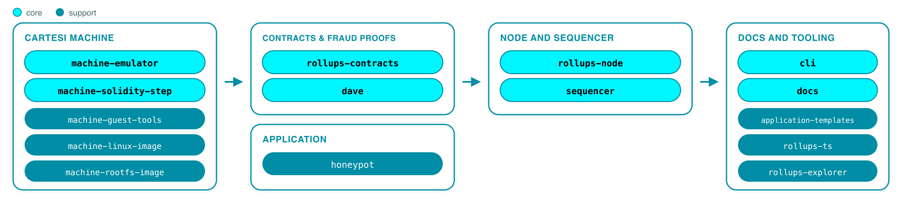

# Cartesi Engineering Map

[Cartesi](https://cartesi.io) enables developers to build with the languages, libraries, and tools they know and love. Application computation runs inside a deterministic RISC-V virtual machine with a full Linux runtime.

This page provides a curated map of the repositories that make up and support Cartesi’s current engineering stack, with a particular focus on the **Rollups v2** architecture under active integration as of mid-2026.

> **Note:** This map is not exhaustive. Older, supporting, and superseded repositories remain public and open source on [`github.com/cartesi`](https://github.com/cartesi) for anyone to inspect, build on, or continue developing.

## Current engineering stack

Coordinated releases generally flow from the execution layer into contracts and fraud proofs, then the node, client tooling, explorer, CLI, and templates. The diagram below divides the stack into **Core Protocol** and **Tools & Resources**.

### How the pieces fit

1. **Cartesi Machine** - Deterministic RISC-V + Linux execution ([`machine-emulator`](https://github.com/cartesi/machine-emulator)), with an on-chain micro-architecture step verifier ([`machine-solidity-step`](https://github.com/cartesi/machine-solidity-step)) and guest-side tooling / rootfs ([`machine-guest-tools`](https://github.com/cartesi/machine-guest-tools), [`machine-linux-image`](https://github.com/cartesi/machine-linux-image), [`machine-rootfs-image`](https://github.com/cartesi/machine-rootfs-image)).
2. **Rollups Contracts** - L1 data availability (`InputBox`), application settlement, asset portals, and Authority / Quorum consensus and emergency-withdrawal primitives. ([`rollups-contracts`](https://github.com/cartesi/rollups-contracts)).
3. **Fraud Proofs** - Permissionless dispute-resolution system ([`dave`](https://github.com/cartesi/dave)). PRT is the algorithm in use today; the eponymous Dave algorithm is research / next. Coupled tightly to rollups-contracts and the machine step.
4. **Rollups Node** - Middleware between base layer contracts, the machine, and clients ([`rollups-node`](https://github.com/cartesi/rollups-node)): Machine advance, claims, a frontend JSON-RPC API, and a separate inspect REST API.
5. **Sequencer** - Optional low-latency path for UX ([`sequencer`](https://github.com/cartesi/sequencer)): soft-confirms user operations and posts them in batches to InputBox. Not part of the SDK / CLI release train.
6. **Tools & Resources** - Developer-facing entry points for learning, building, and testing applications: [`cli`](https://github.com/cartesi/cli), [`application-templates`](https://github.com/cartesi/application-templates), TypeScript clients ([`rollups-ts`](https://github.com/cartesi/rollups-ts)), Explorer ([`rollups-explorer`](https://github.com/cartesi/rollups-explorer)), and [`docs`](https://github.com/cartesi/docs).

## Start here

- **Understand the architecture** - [Rollups architecture](https://docs.cartesi.io/cartesi-rollups/2.0/getting-started/architecture/)
- **Build an application** - [Quickstart guide](https://docs.cartesi.io/get-started/quickstart/)
- **Explore the execution layer** - [Cartesi Machine docs](https://github.com/cartesi/machine-emulator/blob/main/doc/README.md)

## Repository map

The table below lists the repositories in the current stack, with a short purpose for each and a status label. The *Status* column describes a repository’s role in this mapped stack:

- **Production** - stable releases in production use (may still receive ongoing development)
- **Active development** - part of the current Rollups v2 integration train; expect change until the stack stabilizes
- **Experimental** - prototype or research; not yet validated for broader use

| Repository                                                                | Purpose                                                                                                                                                                                                                     | Status             |
| ------------------------------------------------------------------------- | --------------------------------------------------------------------------------------------------------------------------------------------------------------------------------------------------------------------------- | ------------------ |
| [machine-emulator](https://github.com/cartesi/machine-emulator)           | Off-chain RISC-V Cartesi Machine (C++). Deterministic Linux VM, Merkle proofs, JSON-RPC / Lua / C APIs. Optional RISC Zero integration for proofs of machine state transitions.                                             | Production         |
| [machine-solidity-step](https://github.com/cartesi/machine-solidity-step) | On-chain micro-architecture state-transition function that must match the emulator bit-for-bit for fraud proofs.                                                                                                            | Production         |
| [machine-guest-tools](https://github.com/cartesi/machine-guest-tools)     | Provides tools for the Cartesi machine, including a RISC-V Debian package and a root filesystem for Ubuntu.                                                                                                                 | Production         |
| [machine-linux-image](https://github.com/cartesi/machine-linux-image)     | Provides the Docker configuration files to build the Linux kernel image used by the Cartesi machine.                                                                                                                        | Production         |
| [machine-rootfs-image](https://github.com/cartesi/machine-rootfs-image)   | Build pipeline for root filesystem images. Supporting image-build tooling, with current guest rootfs artifacts also published via machine-guest-tools.                                                                      | Production         |
| [rollups-contracts](https://github.com/cartesi/rollups-contracts)         | Rollups smart contracts: InputBox, Application, portals, Authority / Quorum. Deployed as a public good on major EVM chains. Stable v2 in production, and v3 alphas add claim-lifecycle and emergency-withdrawal primitives. | Active development |
| [dave](https://github.com/cartesi/dave)                                   | Permissionless fraud-proof suite with contracts and Rust / Lua nodes, versioned with rollups-contracts. PRT has stable releases and powers Honeypot. The v3 integration is in alpha and the Dave algorithm is in research.  | Active development |
| [honeypot](https://github.com/cartesi/honeypot)                           | Hardened ERC-20 vault DApp used as a security reference on Cartesi Rollups.                                                                                                                                                 | Production         |
| [rollups-node](https://github.com/cartesi/rollups-node)                   | Reference Rollups node: L1 reader, machine runner, claims, frontend JSON-RPC API, and inspect REST API. Integration pivot for the SDK. v2 alphas toward stable.                                                             | Active development |
| [sequencer](https://github.com/cartesi/sequencer)                         | Optional centralized sequencer prototype: optimistic soft confirmations, deterministic ordering, batched L1 submission, recovery, and watchdog. CLI / SDK integration unfinished.                                           | Experimental       |
| [cli](https://github.com/cartesi/cli)                                     | Cartesi CLI + SDK image: create, build, run, deploy. Replaces the previous v1.x / Sunodo development and deployment workflow.                                                                                               | Active development |
| [application-templates](https://github.com/cartesi/application-templates) | Starter templates for creating Cartesi apps across popular programming languages.                                                                                                                                           | Active development |
| [rollups-ts](https://github.com/cartesi/rollups-ts)                       | TypeScript libraries (`@cartesi/rpc`, client / react packages, etc.) for frontends and tooling.                                                                                                                             | Active development |
| [rollups-explorer](https://github.com/cartesi/rollups-explorer)           | Rollups application explorer UI.                                                                                                                                                                                            | Active development |
| [docs](https://github.com/cartesi/docs)                                   | Official documentation (Docusaurus), including machine-readable / LLM-oriented delivery. Continuously updated alongside the stack.                                                                                          | Production         |

## Release status

As of mid-2026, the Rollups **v2** stack is progressing through coordinated alpha releases across the node, contracts, fraud-proof system, CLI/SDK, explorer, and TypeScript clients. Cartesi Machine components, including the emulator, Solidity step, and guest tools, continue to publish production releases used by the v2 stack.

Join the [Cartesi Discord](https://discord.gg/cartesi) for community discussion, questions, and updates on the stack.