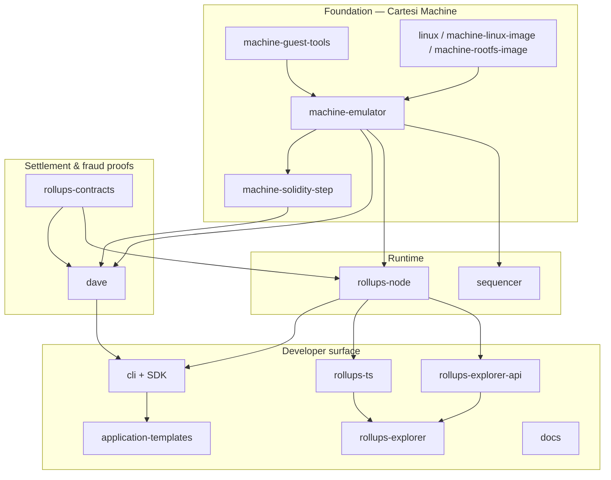

# Cartesi Github Org

[Cartesi](https://cartesi.io) is a Linux-capable execution environment for blockchain applications. Computation runs off-chain inside a deterministic RISC-V virtual machine (the **Cartesi Machine**).

This document maps the public repositories under [`github.com/cartesi`](https://github.com/cartesi). It is oriented around the **Rollups v2** engineering stack that is under active integration as of mid-2026.

**Status legend**

| Status | Meaning |
| --- | --- |
| **Production** | Released and used in live or supported deployments; still maintained. |
| **Active development** | Primary engineering focus; APIs and releases may still be alpha. |
| **Legacy** | Not archived, but superseded or dormant; prefer the successor. |
| **Archived** | Frozen on GitHub; historical reference only. |

---

## Current engineering stack

The Rollups stack is versioned as a dependency chain. Changes propagate in a fixed order: machine → contracts / fraud proofs → node → TypeScript / explorer / CLI → templates.

**How the pieces fit**

1. **Cartesi Machine** — deterministic RISC-V + Linux execution (`machine-emulator`), with an on-chain micro-architecture step verifier (`machine-solidity-step`) and guest-side tooling / rootfs (`machine-guest-tools`, Linux image repos).
2. **Rollups contracts** — L1 data availability (`InputBox`), application settlement, portals, Authority / Quorum consensus, and emergency-withdrawal primitives (`rollups-contracts`).
3. **Fraud proofs** — permissionless dispute system (`dave`, PRT today; Dave algorithm next), coupled tightly to contracts and the machine step.
4. **Node** — middleware between L1 contracts, the machine, and clients (`rollups-node`): advance/inspect, claims, GraphQL / JSON-RPC surfaces.
5. **Sequencer** — optional low-latency soft-confirmation path (`sequencer`); shares the emulator and is converging on node deployment conventions, not yet a required dependency of the SDK release train.
6. **Developer tools** — CLI/SDK, templates, TypeScript clients, explorer, and documentation.

Pinned entry points on the org: [machine-emulator](https://github.com/cartesi/machine-emulator), [rollups-node](https://github.com/cartesi/rollups-node), [rollups-contracts](https://github.com/cartesi/rollups-contracts), [machine-guest-tools](https://github.com/cartesi/machine-guest-tools), [dave](https://github.com/cartesi/dave), [cli](https://github.com/cartesi/cli).

---

## Repository map

### Foundation — Cartesi Machine

| Repository | Purpose | Status |
| --- | --- | --- |
| [machine-emulator](https://github.com/cartesi/machine-emulator) | Off-chain RISC-V Cartesi Machine (C++). Deterministic Linux VM, Merkle proofs, JSON-RPC / Lua / C APIs. Optional RISC Zero step-proving path. | **Production** / ongoing **active development** |
| [machine-solidity-step](https://github.com/cartesi/machine-solidity-step) | On-chain micro-architecture state-transition function; must match the emulator bit-for-bit for fraud proofs. | **Production** / **active development** |
| [machine-guest-tools](https://github.com/cartesi/machine-guest-tools) | Guest tools, RISC-V Debian packages, and root filesystem artifacts for machines. | **Production** / **active development** |
| [linux](https://github.com/cartesi/linux) | Cartesi-patched Linux kernel sources. | **Production** |
| [machine-linux-image](https://github.com/cartesi/machine-linux-image) | Build pipeline for the kernel image. | **Production** |
| [machine-rootfs-image](https://github.com/cartesi/machine-rootfs-image) | Build pipeline for the root filesystem image. | **Production** |
| [machine-emulator-sdk](https://github.com/cartesi/machine-emulator-sdk) | Packaging / SDK conveniences around the emulator. | **Legacy** (prefer emulator releases + guest-tools / CLI SDK) |
| [machine-emulator-rom](https://github.com/cartesi/machine-emulator-rom) | Machine ROM. | **Legacy** |
| [machine-tests](https://github.com/cartesi/machine-tests) | Low-level machine test fixtures. | **Legacy** |
| [machine-emulator-defines](https://github.com/cartesi/machine-emulator-defines) | Shared C defines for the emulator. | **Legacy** |
| [image-toolchain](https://github.com/cartesi/image-toolchain) | RISC-V toolchain container image. | **Legacy** |
| [openapi-interfaces](https://github.com/cartesi/openapi-interfaces) | Shared OpenAPI HTTP interface specs. | **Legacy** / supporting |
| [grpc-interfaces](https://github.com/cartesi/grpc-interfaces) | Historical gRPC interface definitions. | **Legacy** → superseded by JSON-RPC / node APIs |
| [homebrew-tap](https://github.com/cartesi/homebrew-tap) | Homebrew distribution for Cartesi packages. | **Production** |
| [linux-packages](https://github.com/cartesi/linux-packages) | Linux package repository. | **Production** |
| [macports-ports](https://github.com/cartesi/macports-ports) | MacPorts packaging. | **Production** |

### Settlement, consensus, and fraud proofs

| Repository | Purpose | Status |
| --- | --- | --- |
| [rollups-contracts](https://github.com/cartesi/rollups-contracts) | Rollups smart contracts: InputBox, Application, portals, Authority/Quorum, claim staging, emergency withdrawal. Deployed as a public good on major EVM chains. | **Production** (v2 line) / **active development** (v3 alphas) |
| [dave](https://github.com/cartesi/dave) | Permissionless fraud-proof suite (PRT algorithm; Dave algorithm research/next). Contracts + Rust/Lua nodes. Versioned with rollups-contracts. | **Active development** (experimental / alpha) |
| [dave-monitoring](https://github.com/cartesi/dave-monitoring) | Monitoring for Dave smart contracts. | **Active development** |
| [solidity-util](https://github.com/cartesi/solidity-util) | Shared Solidity utility contracts. | **Production** / supporting |
| [honeypot](https://github.com/cartesi/honeypot) | Hardened ERC-20 vault DApp used as a security reference on Cartesi Rollups. | **Production** (reference application) |

### Runtime — node and sequencing

| Repository | Purpose | Status |
| --- | --- | --- |
| [rollups-node](https://github.com/cartesi/rollups-node) | Reference Rollups node: L1 reader, machine runner, claims, GraphQL / inspect / JSON-RPC. Integration pivot for the SDK. | **Active development** (v2 alphas toward stable) |
| [sequencer](https://github.com/cartesi/sequencer) | Deterministic sequencer with soft confirmations, batch submission, recovery, and watchdog. | **Active development** (prototype / alpha; testnet deployment in progress) |
| [rollups-graphql](https://github.com/cartesi/rollups-graphql) | Standalone GraphQL convenience / voucher-management service. | **Legacy** / optional (node ships its own GraphQL) |
| [helm-charts](https://github.com/cartesi/helm-charts) | Kubernetes Helm charts for deploying Cartesi services. | **Active development** |
| [setup-action](https://github.com/cartesi/setup-action) | GitHub Action to set up Cartesi tooling in CI. | **Active development** |

### Developer surface

| Repository | Purpose | Status |
| --- | --- | --- |
| [cli](https://github.com/cartesi/cli) | Cartesi CLI + SDK image: create, build, run, deploy. Successor to Sunodo branding. | **Active development** (v2 alphas) |
| [application-templates](https://github.com/cartesi/application-templates) | Templates consumed by `cartesi create`. | **Active development** |
| [rollups-ts](https://github.com/cartesi/rollups-ts) | TypeScript libraries (`@cartesi/rpc`, client/react packages, etc.) for frontends and tooling. | **Active development** |
| [rollups-explorer](https://github.com/cartesi/rollups-explorer) | Rollups application explorer UI. | **Active development** |
| [rollups-explorer-api](https://github.com/cartesi/rollups-explorer-api) | Indexer / API behind the Rollups explorer. | **Active development** |
| [docs](https://github.com/cartesi/docs) | Official documentation (Docusaurus), including machine-readable / LLM-oriented delivery. | **Production** / **active development** |
| [erc-4337-devnet](https://github.com/cartesi/erc-4337-devnet) | Local ERC-4337 development environment used with AA / paymaster flows. | **Active development** |
| [passkey-server](https://github.com/cartesi/passkey-server) | Passkey server for ZeroDev Kernel integrations. | **Active development** |

### CTSI staking and chain explorer (PoS)

Distinct from application Rollups: Cartesi token staking / PoS node software and the public staking explorer.

| Repository | Purpose | Status |
| --- | --- | --- |
| [noether](https://github.com/cartesi/noether) | Noether node (PoS). | **Production** / maintenance |
| [pos-dlib](https://github.com/cartesi/pos-dlib) | Proof-of-Stake library. | **Production** / maintenance |
| [staking-pool](https://github.com/cartesi/staking-pool) | Staking pool UI / contracts surface. | **Production** / maintenance |
| [explorer](https://github.com/cartesi/explorer) | Cartesi blockchain / staking explorer. | **Production** / maintenance |
| [subgraph](https://github.com/cartesi/subgraph) | The Graph subgraph definitions. | **Production** / maintenance |

### Research, demos, and misc

| Repository | Purpose | Status |
| --- | --- | --- |
| [zk-benchmarks](https://github.com/cartesi/zk-benchmarks) | ZK proving benchmarks related to machine steps. | **Active development** (research) |
| [experiments](https://github.com/cartesi/experiments) | DApp showcase experiments. | **Active development** |
| [creepts-*](https://github.com/cartesi?q=creepts) | Historical Creepts game demos. | **Legacy** |
| [cips](https://github.com/cartesi/cips) | Cartesi Improvement Proposals process. | **Legacy** / process |

---

## Where to start

| Goal | Start here |
| --- | --- |
| Understand the product | [docs.cartesi.io](https://docs.cartesi.io) → [docs](https://github.com/cartesi/docs) |
| Build an application | [cli](https://github.com/cartesi/cli) + [application-templates](https://github.com/cartesi/application-templates) |
| Run / operate a rollup | [rollups-node](https://github.com/cartesi/rollups-node) + [rollups-contracts](https://github.com/cartesi/rollups-contracts) |
| Soft confirmations / latency | [sequencer](https://github.com/cartesi/sequencer) |
| Fraud proofs / disputes | [dave](https://github.com/cartesi/dave) |
| Machine internals | [machine-emulator](https://github.com/cartesi/machine-emulator) + [machine-solidity-step](https://github.com/cartesi/machine-solidity-step) |
| Frontend integration | [rollups-ts](https://github.com/cartesi/rollups-ts) + [rollups-explorer](https://github.com/cartesi/rollups-explorer) |

---

## Related work outside `cartesi/*`

These appear in local engineering checkouts and the Q2 2026 technical report; they are part of the developer/agent surface but are not all under the `cartesi` GitHub org:

| Project | Role |
| --- | --- |
| **cartesi-skills** | Curated skill packs for AI coding agents (scaffold, backend, contracts, deploy, debug). |
| **MCP-Server** (+ admin frontend/server) | Model Context Protocol knowledge server exposing curated docs, articles, and skills to agents. |
| **Mugen-Builders** demos | Example DeFi / data apps (Uniswap vault, Pandas, markets, etc.) illustrating Linux-on-rollup workloads. |

---

## Notes on versioning

As of mid-2026, the Rollups **v2** line is shipping coordinated **alphas** (node, contracts, Dave/PRT, CLI/SDK, explorer, TypeScript clients). Foundation packages (emulator, solidity step, guest tools) publish production releases that the alpha line pins. Treat “production” above as *in production use or release-quality*, and “active development” as *still converging on a stable SDK designation* — especially for contracts that custody funds and for the sequencer before live testnet soak.

For the dependency order used in integration releases, see the stack diagram above: **emulator → contracts / dave → node → rollups-ts / explorer / CLI → templates**.
